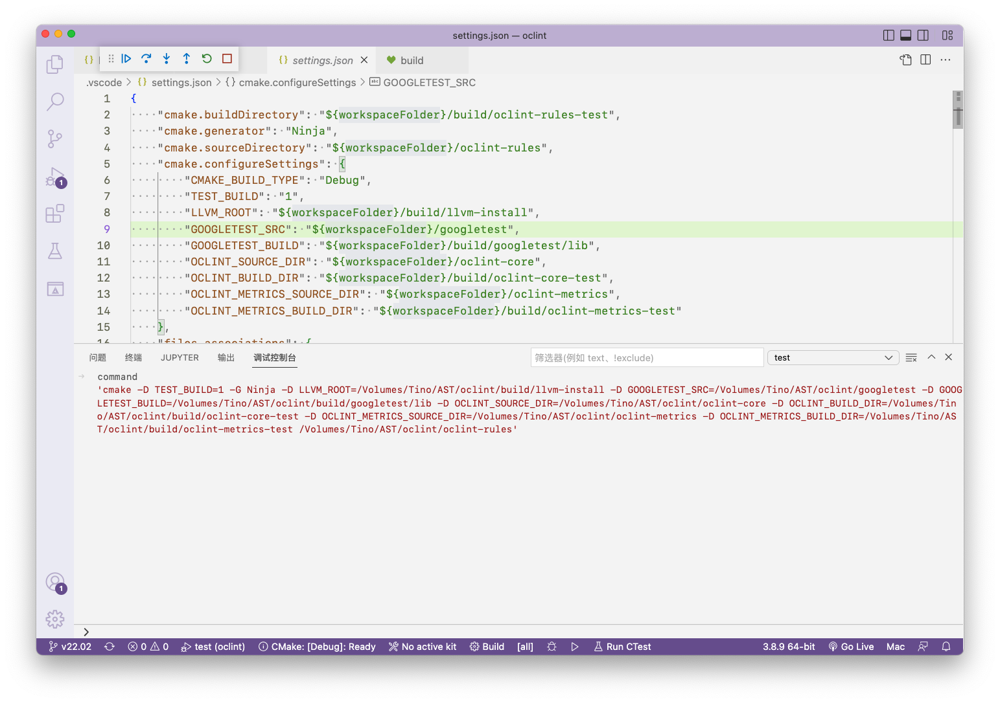
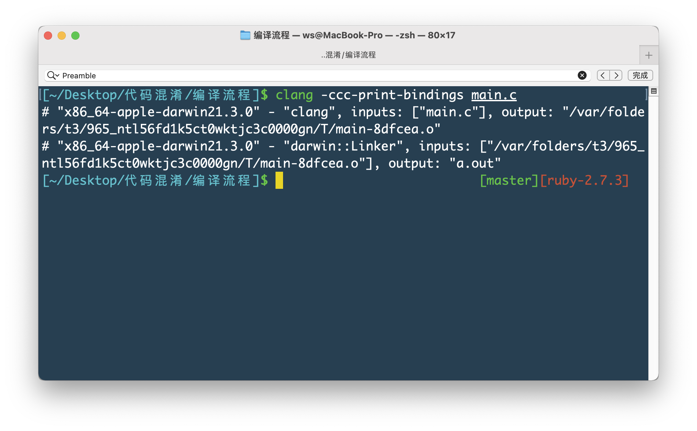

# Clang-AST
## 一、如何调试`OCLint`？
首先确定要调试什么？
我们想要研究的是`OCLint`内部的实现逻辑。
那现在就有两个选择：
### 1. 直接调试生成的`OCLint`可执行文件
如果是正常编译生成的`OCLint`可执行文件，内部不是没有包含调试信息的。那就意味着如果通过终端或者`vscode`使用`lldb`调试，并不能进行源码调试。
那就需要在编译时生成调试信息。可以看到初始编译时，使用的是`oclint-scripts/make`脚本，这个脚本实际调用的是`oclint-scripts/ci`的`py`脚本，又有`oclint-scripts/ci`调用`build`、`test`、`googleTest`等`py`脚本，帮助把`llvm`环境以及辅助工具`googleTest`等引入到产物目录。在使用`ci`脚本时，如果传入`-release`参数，那么在生成`OCLint`时，并不会生成调试信息。所以，可以把`make`包含的命令修改为：
```sh
./ci -reset "$@"
./ci -setup "$@"
```
如果，不是首次编译，那么可以直接调用`oclint-scripts/build`脚本，不使用`-release`参数，同时需要使用`-llvm-root`参数，将`build/llvm-install`目录传递进去。也可以指定`OCLint`中部分模块需要生成调试信息：
```sh
./build -clean -llvm-root=<oclint dir>/build/llvm-install driver
```
该命令会在`build/oclint-driver/bin`目录下重新生成`oclint`包含调试信息的可执行文件。
除了上述方式，当也可以直接使用`cmake`帮助我们重新生成包含调试信息的`oclint`可执行文件。通过调试`oclint-scripts/build`脚本，发现实际调用的`cmake`命令为：

进入到`build/oclint-driver`目录，不存在的话，自己创建一个，执行：
```sh
cmake -G Ninja -D LLVM_ROOT=<your path>/build/llvm-install -D OCLINT_SOURCE_DIR=<your path>/oclint-core -D OCLINT_BUILD_DIR=<your path>/build/oclint-core <your path>/oclint-driver
```
如果不放心，可以再在该命令中加入`CMAKE_BUILD_TYPE=Debug`。但是实际上并不管用，因为在`oclint-core/cmake/OCLintConfig.cmake`的`cmake`模块中，已经将`CMAKE_BUILD_TYPE`指定为`None`。所以你会收到如下提示：
```sh
The build configurations generated do not contain the active build configuration. Using "None" for CMAKE_BUILD_TYPE instead of "Debug" to ensure that IntelliSense configurations can be found
```
`cmake`会生成配置好的`ninja`工程。然后就可以调用`ninja`命令，执行构建。接下来就可以使用终端或者`vscode`，开始调试。

**还有一点需要注意：**`oclint`使用的`llvm`功能模块，是`release`版本，也不包含调试信息。所以，可以使用自编译带调试信息`llvm`进行替换。`oclint`使用的核心库：
```sh
clangToolingCore
clangTooling
clangFrontend
clangDriver
clangSerialization
clangParse
clangSema
clangAnalysis
clangEdit
clangASTMatchers
clangAST
clangLex
clangRewrite
clangBasic
```
你可以进行整体`llvm-install`目录替换。也可以对指定库进行替换，例如`libclangTooling.a`。替换前注意`llvm`版本是否匹配，否则容易出现符号问题。


### 2. `oclint test`
如果直接上手调试`oclint`核心功能，会沉浸在复杂的调试中。好在`oclint`的每个核心模块都有清晰的测试代码。通过调试测试代码，更好的帮助我们去理解像`rule`到底是如何注册以及执行。
如果是第一次编译`oclint`，按照方式一，不加`-release`参数，会自动引入`googleTest`，同时会将测试用例一并进行编译那么。
如果，不是第一次编译，需要执行`oclint-scripts/googleTest`的`py`脚本，将`googleTest`引入并编译到`build`目录：
```sh
./googleTest checkout
./googleTest build
```
接下来执行`oclint-scripts/test`脚本，指定要测试的模块代码。默认是`all`：
```sh
./test rules
```
通过调试发现`oclint-scripts/test`，实际运行的`cmake`命令为：


```sh
cmake -D TEST_BUILD=1 -G Ninja 
-D LLVM_ROOT=<your path>/build/llvm-install 
-D GOOGLETEST_SRC=<your path>/googletest 
-D GOOGLETEST_BUILD=<your path>/build/googletest/lib 
-D OCLINT_SOURCE_DIR=/<your path>/oclint-core 
-D OCLINT_BUILD_DIR=<your path>/build/oclint-core-test 
-D OCLINT_METRICS_SOURCE_DIR=<your path>/oclint-metrics 
-D OCLINT_METRICS_BUILD_DIR=<your path>/build/oclint-metrics-test 
<your path>/oclint-rules
```
然后执行`ninja`命令。

**注意**：如果使用`vscode`的话，在引入`cmake`环境后，设置`settings.json`或者`CMakePresets.json`，将参数传入：

### 3. 使用`Xcode`调试`oclint`
如果想使用`Xcode`调试`oclint`，可以直接通过`cmake`将构建系统改为`Xcode`，生成`Xcode`项目。
如果想要手动体验一下，`cmake`执行完毕之后，到底配置了那些编译，链接参数。
可以使用在使用`cmake`时，设置`CMAKE_EXPORT_COMPILE_COMMANDS=ON`，生成`compile_commands.json`文件。在使用`ninja`时，传入参数`-t compdb`，生成`compile_commands.json`文件。查看里面的编译参数。在`xcode Build Setting`中需要配置四个地方：
```sh
HEADER_SEARCH_PATHS #头文件搜索
LIBRARY_SEARCH_PATHS #库文件搜索
OTHER_LDFLAGS #链接器参数
OTHER_CPLUSPLUSFLAGS #CXX编译器参数
```


> **注意⚠️**：如果不想使用`ninja`。那么在使用`cmake`命令的时候，将`-G Ninja`改为你需要使用的构建系统，执行的编译命令也有随之更改。
> 


## 二、`OCLint`是如何使用内置的规则（`Rule`）的？

不论是内置的规则`rules`，还是自定义`rules`。在生成`dylib`后，都会被放置在`build/oclint-release/lib/oclint/rules`目录中。当执行`oclint`时，可以指定哪些规则生效，哪些规则是`disable`。那么问题来了？`oclint`可执行文件是如何找到这些`dylib`，并产生交互的？

### 1、加载`rules`动态库
在`macho`中，如果`exec/dylib`使用到其他的`exec/dylib`的功能时。会把调用的符号以间接符号的形式存储在符号表中，也可以将符号标记为`dynamic_lookup`，将符号的处理时机，交给运行时，避免在`linker`工作期间，造成`undefined symbol`。
同时会在`macho`生成单独的`load command`用来保存使用到的`exec/dylib`路径。
通过查看`oclint`可执行文件的`header`信息：

并没有发现`rules`动态库的加载路径。那么可以确定，一定是运行的时候，动态加载的这些`rules`动态库。
在`/oclint-driver/rules_dlfcn_port.cpp`中可以看到：

实际上是通过`dlopen`加上`RTLD_LAZY`，加载所有`rules`动态库。
> `RTLD_LAZY/RTLD_NOW`：通过`dlopen`加载的动态库如果使用到了其他动态库/可执行文件的符号，此时该符号是未定义符号。`dlopen`在加载时，有两个选择。是立即加载解析该未定义符号，还是等到使用到该符号时在进行加载解析（懒加载/非懒加载符号）。

并且此时到`ruleDirPath`固定为`oclint`可执行文件所在目录`../lib//oclint/rules`路径：

`rule`动态库是如何加载的我们知道了，那么符号呢？`oclint`是如何与`rules`动态库进行交互的呢？

### 2、oclint`与`rule`动态库进行交互
当我们查看`oclint`内置的`rules`或者自定义`rule`时，通常需要按照功能继承：
```c++
//clang::MatchFinder
AbstractASTMatcherRule
//clang::RecursiveASTVisitor 
AbstractASTVisitorRule 
AbstractSourceCodeReaderRule
```
当编写完`rule`时，会立刻执行`rule`初始化，将`rule`保存在`RuleSet`的`_rules`数组中：


至此，只要保证需要的`rules`动态库正常加载，那么，`oclint`就能将要分析的代码`AST`等传递到`rules`动态库中处理，同时将处理结果返回给`oclint`处理。

## 三、关于`AST`结构
查看下面代码的`AST`结构：
```oc
@interface I
@end
@implementation I

- (void) method{ }

int anotherNestedFunction(int x) {
  return x;
}

@end

@implementation I(Cat)

void catF() { }

@end
```
图形化之后：

可以看到，每个`AST Node`都是一个`Decl`或者`Stmt`的实例。
* `Decl`表示声明。其子类用于不同的声明类型：
    * `TranslationUnitDecl`：表示`AST`的入口
    * `FunctionDecl`：函数声明
    * `ParmVarDecl`：参数声明
    * `VarDecl`：用于局部和全局变量声明
* `Stmt`表示语句，其子类用于不同的语句类型：
    * `CompoundStmt`：表示代码块
    * `DeclStmt`：局部变量声明
    * `IfStmt`表示`if`语句
    * `ReturnStmt`表示`return`语句
    * `ForStmt`：`for`
    * `BinaryOperator`：二元表达式
    * `UnaryOperator`：`++`
    * `Expr`：表达式
        * `CallExpr`：函数调用
        * `ImplicitCastExpr`：隐式类型转换
        * `DeclRefExpr`：引用声明的变量和函数
        * `IntegerLiteral`：`int`

### 1、 查看`method`方法
更详细的查看`method`方法的`AST node`：
```
- (void) method{ }
```

可以看到整个是一个树状结构，此时的根结点为`ObjCMethodDecl`，拥有四个属性：
* `loc`：表示该方法在源文件的位置
* `range`：表示该方法所占的空间
* `returnType`：返回值类型
* `inner`：实际该方法实际的调用信息：
    * `ImplicitParamDecl`：两个隐式参数，表示`OC`方法定义的两个默认参数`_self`和`_cmd`
    * `CompoundStmt`：表示`code block`
 
 可以看到，每个`Decl`都有自己的`name`和`type`。
 
 ### 2、获取`AST`信息
 当需要执行前端动作`Action`时，入口点是`FrontentdAction`。此时要获取`AST`信息，实际上执行的`Action`是`ASTFrontendAction`。`FrontentdAction`内置`Execute()`函数，会调用指定工具，执行`Action`的内置任务。`ASTFrontendAction`在`Execute`时，会调用`ParseAST()`进行生成和遍历`AST`。同时会将整个过程传递给`ASTConsumer`的回调函数：
* 当解析到每个当最上层的声明时，调用`ASTConsumer`中的回调函数`HandleTopLevelDecl()`。`HandleTopLevelDecl()`接收一组`function`声明和全局变量的声明作为参数；
    * 接下来使用`RecursiveASTVisitor`调用`TraverseDecl()`以深度优先的方式递归从顶部`Decl`进行扫描。`RecursiveASTVisitor`为绝大多数的`AST node`提供了`VisitNodeType(NodeType *)`函数。该函数的返回值为`false`，则停止遍历：
        * 当遇到`Stmt`时，调用`VisitStmt`
        * 当遇到`Decl`时，调用`VisitDecl`
* 当整个单元解析完后，调用`HandleTranslationUnit()`，获取`ASTContext`；

如果想获取源码信息代码，从`dump`出的`AST`信息可以看出。`Decl`和`Stmt`都有`loc`和`range`信息。这个在`llvm`是通过`SourceLocation`进行表示的：
* `getLocStart()`返回起始位置
* `getLocEnd()`返回的`last-1 token`的位置。可以简单理解为，实际获取的是`end -1`位置，并不是真正的位置
* 如果想获取正确位置，需要使用`Lexer`的静态函数`findLocationAfterToken(loc, tok,… )`返回`loc`之后第一个`Tkind`类型的`token`所在的位置。`loc`可以通过`SourceLocation.getLocWithOffset(offset,…)`获取。

同时，还有一个`SourceManager`与`SourceLocation`配合使用来获取源代码更具体的信息：
* `getMainFileID()`获取当前处理文件
* `getExpansionLineNumber()`行号
* `getExpansionColumnNumber()`列号

 ### 3、`AST`与通过`Rewriter`
如果想要修改代码，可以使用`Rewriter`。该类具有有插入、删除和替换代码的功能：
* `InsertTextAfter(loc,str)`
* `InsertTextBefore(loc,str)`
* `RemoveText(loc,size)`
* `ReplaceText(…)`

关于`loc`、`size`、`str`参数：
* `loc`实际上就是`SourceLocation`用来表示修改位置，
* `str`文本
* `size`处理文本大小

```c++
Rewrite.InsertText(IfS->getIfLoc(), "// the 'if' part\n", true, true);
```

当修改完毕后，通过`Rewriter`当`getRewriteBufferFor()`获取修改后的代码：
```c++
const RewriteBuffer *RewriteBuf =
            TheRewriter.getRewriteBufferFor(compilerInstance->getSourceManager().getMainFileID());
        llvm::outs() << std::string(RewriteBuf->begin(), RewriteBuf->end());
```


## 四、实现一个`OCLint`
`OCLint`实际上与`clang-tidy`类似，是一个基于 `clang`的`C`、`C++`和`Objective-C` 的`linter`。
`OCLint`通过自定义`compiler`，通过使用原有编译参数，编译代码文件，执行`static analyzer`，并将结果输出到`html`中。

自定义`compiler`实际上就是初始化`clang`的过程，整个过程非常复杂。
完整代码，见`clang_ast_re.cpp`文件。

### 1、命令行参数解析
`clang::tooling::CommonOptionsParser`是
`clang`内置的命令行解析器。将参数交给`FixedCompilationDatabase`解析和保存。`FixedCompilationDatabase`也可以自动定位`compile_commands.json`或`compile_flags.txt`获取`compilation database`编译数据库。
如何想要自定义参数，例如：
```c++
// OptionCategory用来描述一组功能相近的参数的名称和描述信息
static cl::OptionCategory CatToolCategory("Cat tool options", "Cat tool description");
// 在原有帮助信息基础上再添加更多，用来举例或者更详细描述该工具的使用方式
static cl::extrahelp CommonHelp(CommonOptionsParser::HelpMessage);
static cl::extrahelp MoreHelp("\nMore help text...\n");
// 将自定义参数添加到OptionCategory中
static llvm::cl::opt<bool> args(
    "cat", 
    llvm::cl::desc("该参数的描述信息"),
    // 初始化值
    llvm::cl::init(false),
    // 该参数所属的OptionCategory
    llvm::cl::cat(CatToolCategory)
);
int main(int argc, const char **argv)
{
    auto op = CommonOptionsParser::create(argc, argv, CatToolCategory);
    if (!op)
    {
        llvm::errs() << op.takeError();
        return -1;
    }
    return 0;
}
```

接下来获取`FixedCompilationDatabase`：
```c++
CompilationDatabase &compilationDatabase = op->getCompilations();
```
获取当前要处理的代码文件路径：
```c++
llvm::ArrayRef<std::string> sourcePaths = op->getSourcePathList();
```
遍历路径，获取`compile_commands.json`或`compile_flags.txt`交给`FixedCompilationDatabase`提取编译参数：
```c++
for (const auto &sourcePath : sourcePaths)
{
    std::string filePath(clang::tooling::getAbsolutePath(sourcePath)); 
    //  解析  
    std::vector<clang::tooling::CompileCommand> compileCmdsForFile = compilationDatabase.getCompileCommands(filePath);
    if (compileCmdsForFile.empty())
    {
        llvm::errs() << "Skipping " << filePath << ". Compile command not found.\n";
        continue;
    }
    // typedef std::vector<std::pair<std::string, clang::tooling::CompileCommand>> CompileCommandPairs;
    for (auto &compileCommand : compileCmdsForFile)
    {
        compileCommands.push_back(std::make_pair(filePath, compileCommand));
    }
}
```

### 2、 参数调整器`clang::tooling::ArgumentsAdjuster`
`ArgumentsAdjuster`可以帮助在开始编译前，按照指定的方式处理参数：
```c++
/**
* getClangStripOutputAdjuster: 删除输出相关参数
* getClangSyntaxOnlyAdjuster: 对参数仅进行语法检查
* combineAdjusters: 将多个Adjuster组合在一起
*/
clang::tooling::ArgumentsAdjuster argAdjuster =
        clang::tooling::combineAdjusters(
            clang::tooling::getClangStripOutputAdjuster(),
            clang::tooling::getClangSyntaxOnlyAdjuster());
```

### 3、`clang::DiagnosticsEngine`
用来生成诊断信息，初始化`clang::driver::Driver`。
```c++
// 用于控制DiagnosticsEngine选项
llvm::IntrusiveRefCntPtr<clang::DiagnosticOptions> diagOpts =
            new clang::DiagnosticOptions();
            clang::DiagnosticsEngine diagnosticsEngine(
            llvm::IntrusiveRefCntPtr<clang::DiagnosticIDs>(new clang::DiagnosticIDs()),
            &*diagOpts,
            new clang::DiagnosticConsumer());
```
### 4、`clang::driver::Driver`
构建`clang::driver::Driver`：
```c++
const char *const mainBinaryPath = argv[0];
clang::driver::Driver *driver =
            new clang::driver::Driver(mainBinaryPath, llvm::sys::getDefaultTargetTriple(), diagnosticsEngine);
driver->setTitle("Cat");
// 构建编译作业时是否检查输入文件是否存在。
driver->setCheckInputsExist(false);
```

### 5、创建`clang::driver::Driver`要执行的任务
生成`clang::driver::Compilation`。`Compilation`表示当前`Driver`要执行的`Actions`，和`Actions`要使用的工具信息：
```c++
// BuildCompilation: 通过编译参数构建Compilation
const std::unique_ptr<clang::driver::Compilation> compilation(
            driver->BuildCompilation(llvm::makeArrayRef(argv)));
```
获取要传递给前端的`CC1`参数：
```c++
auto cc1Args = getCC1Arguments(compilation.get());
```
创建`compilerInvocation`：
```c++
auto compilerInvocation = new clang::CompilerInvocation;
        clang::CompilerInvocation::CreateFromArgs(*compilerInvocation, *cc1Args, diagnosticsEngine);
// 退出时禁用内存释放
compilerInvocation->getFrontendOpts().DisableFree = false;
```

### 6、创建`clang`实例，开始编译
`CompilerInstance`主要提供`Action`的执行环境，同时是将执行后的结果保存起来：
```c++
auto compilerInstance = new clang::CompilerInstance();
// 用于保存调用编译器所需数据的帮助类。此类旨在表示编译器的抽象“调用”，包括诸如包含路径、代码生成选项、警告标志等数据。
auto invocation = std::make_shared<clang::CompilerInvocation>(*compilerInvocation);
compilerInstance->setInvocation(std::move(invocation));
compilerInstance->createDiagnostics(new clang::DiagnosticConsumer());
if (!compilerInstance->hasDiagnostics())
{
    llvm::errs() << "cannot create compiler diagnostics";
}
```
创建`Target`：
```c++
compilerInstance->setTarget(clang::TargetInfo::CreateTargetInfo(compilerInstance->getDiagnostics(), compilerInstance->getInvocation().TargetOpts));
if (!compilerInstance->hasTarget())
{
   return -1;
}
```
### 7、创建`clang::SyntaxOnlyAction`
指定要使用的`FrontendAction`。`FrontendAction`是一个接口，它允许在编译过程中执行用户特定的操作，我们可以继承`FrontendAction`自定义`Action`，也可以使用内置的`Action`，例如：`ASTFrontendAction`、`SyntaxOnlyAction`只执行`AST`解析操作：
```c++
for (const auto &input : compilerInstance->getFrontendOpts().Inputs)
{
    if (compilerInstance->hasSourceManager())
    {
        compilerInstance->getSourceManager().clearIDTables();
    }

    clang::FrontendAction *frontendAction = new clang::SyntaxOnlyAction();
    // 在编译代码前，准备`Action`，例如`modulemap`的预处理，头文件的处理等等
    if (frontendAction->BeginSourceFile(*compilerInstance, input))
    {
      // run Action
      static_cast<void>(frontendAction->Execute());
    }
    //frontendAction->EndSourceFile();
}
```
保存当前编译器实例：
```c++
if (!compilerInstance->getDiagnostics().hasErrorOccurred() && compilerInstance->hasASTContext())
{
    compilers.push_back(compilerInstance);
}
```

### 8、获取`ASTContext`
关于当前编译单元的`AST`的部分信息，如源码位置等，并不存储在 `AST node`中，而是存储在`ASTContext`及其关联的`SourceManager`中，所以我们需要保存`ASTContext`，交给`RecursiveASTVisitor`进行检索：
```c++
std::vector<clang::ASTContext *> localContexts;
Rewriter TheRewriter;
// 自定义RecursiveASTVisitor
IfStmtHandler Visitor = IfStmtHandler(TheRewriter);
Visitor.setUpMatcher();
for (auto compiler : compilers)
{
    clang::ASTContext *context = &compiler->getASTContext();
    clang::DeclContext *tu = context->getTranslationUnitDecl();
    for (clang::DeclContext::decl_iterator it = tu->decls_begin(), declEnd = tu->decls_end(); it != declEnd; ++it)
    {
        clang::Decl *decl = *it;
        clang::SourceManager *sourceManager = &context->getSourceManager();
        clang::SourceLocation startLocation = decl->getBeginLoc();
        bool isValidDecl = startLocation.isValid() && sourceManager->isInMainFile(startLocation);
        Visitor.traverse(context, decl);
    }
}
```


## 五、理解编译流程
在日常开发中，如果留意一下代码的编译流程，会发现，代码变成`.o`、`exec`、`.gch`或者`.pcm`文件都是通过一个工具，就是`clang`。


正常来讲，`clang`属于`llvm`前端工具，他并不负责全部的编译流程，为什么像`Assembler`、`Linker`等功能也是由他来处理的呢？这就不得不谈到`clang`的真身`clang-driver`，实际上我们调用的`clang`功能都是由`clang-driver`来实现的。他有两个核心作用：
1. 负责处理代码经过词法分析，语法分析生成的`AST`的过程；
2. 负责处理编译参数。在处理完参数后，判断需要执行的任务列表（`Actions`），将编译流程管道化`Pipeline`。同时，将不属于`clang`业务范围的任务`Bind`到指定的工具（例如后端工具`Assembler`、`Linker`等）处理，同时将对应的参数传递（`Translate`）过去。

打印`Pipeline`需要执行的任务：
* 生成目标文件`.o`的流程：

* 生成可执行文件的流程：

### 完整的编译流程使用到的工具
* `preprocessor`：执行预处理器，处理`#includes` 和`#defines`。使用`-E`参数指示`Clang`在此步骤后停止；
* `Parsing`：生成`AST`，例如`gch`、`pcm`文件。使用`-precompile`参数指示`Clang`在此步骤后停止。当输入是头文件时，该标志是默认值；
* `IR generation`：生成IR。使用`-emit-llvm`参数指示`Clang`在此步骤停止。如果同时使用`-S`，`Clang`将生成文本`.ll`;
    > 可以使用`llvm-dis`将`.bc`->`.ll`或使用`llvm-asm`将`.ll`->`.bc`；
* `Compiler backend`：这`IR`转换为特定于目标的汇编代码。该`-S`参数指示`Clang`在此步骤后停止；
* `Assembler`：将汇编代码转换为目标文件。该`-c`参数指示`Clang`在此步骤后停止；
* `Linker`：这会将多目标文件组合成一个`image`（`dylib`或可执行文件）。
* 
### 查看`clang bind`之后，实际使用的工具：
* 生成目标文件：

* 生成`exec`：

#### 这个地方有一个很大的疑问
在生成目标文件阶段使用的工具一直是`clang`，并没有出现我们认为的`Assembler`，难道这部分功能是由`clang`来负责的？

实际上，为了提升`clang`的编译性能，避免生成文件再解析，再生成汇编代码文件的过程。同时更方便将整个过程与`clang`内置的诊断器联系起来，默认情况下并没有使用外部的汇编器，如`llvm-as`。而是直接使用内部集成的汇编器（`llvm`专门做了一个`llvm-mc`工具方便我们体验）。我们可以使用`-no-integrated-as`参数禁用内置汇编器：
  

## Others(进行中...)
* SwiftLint
* Clang plugins
* Clang Static Analyzer (static analysis)
* clang-tidy (static analysis / linter / refactoring)
* clang-format (coding style)
* clang-check(AST / static analysis)

## 参考文献
[Toolchain](https://clang.llvm.org/docs/Toolchain.html)
[Intro to the LLVM MC Project](https://blog.llvm.org/2010/04/intro-to-llvm-mc-project.html)
[RecursiveASTVisitor](https://clang.llvm.org/docs/RAVFrontendAction.html)
[json data](https://clang.llvm.org/docs/JSONCompilationDatabase.html)


