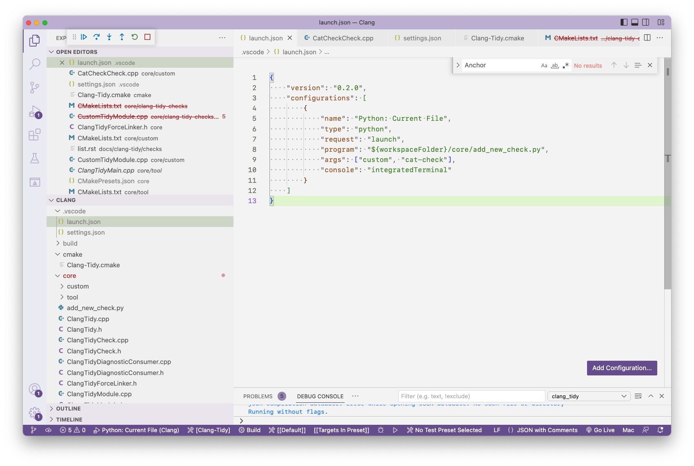
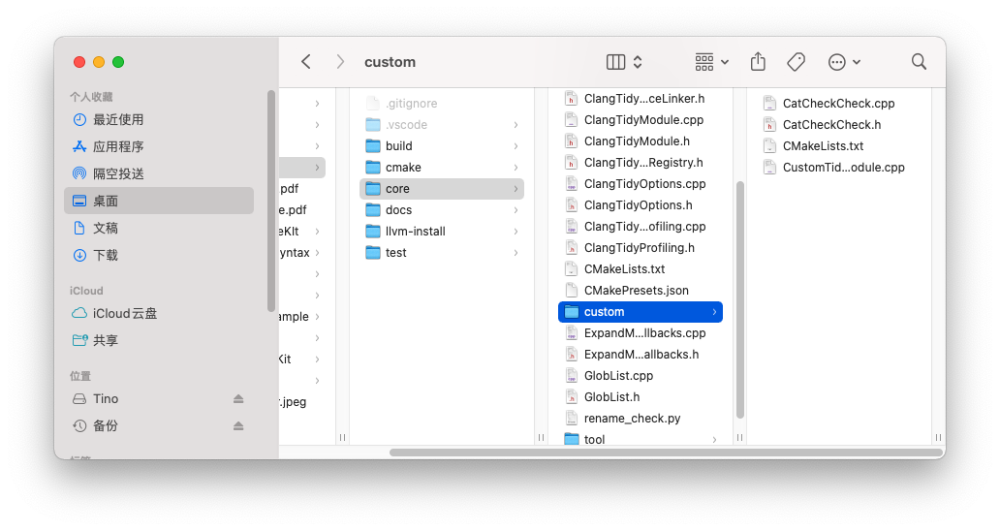
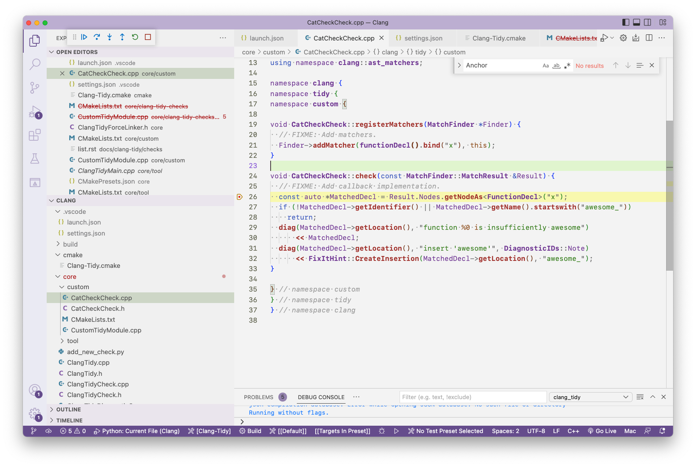

# `clang-tidy`
基于`LibTooling`的`linter`，除了可以进行错误检查，还可以进行修复，同时可以自定义`check`。

在官方的[自定义check](https://clang.llvm.org/extra/clang-tidy/Contributing.html)中，是基于整个`LLVM`构建去实现的，相对来配置简单，只要能编译`LLVM`，然后通过`add_new_check.py`，将想要添加`check`的`module`和`check name`传递给`clang-tidy`，就在自动在`module`的目录创建自定义`check`的文件。

但是问题就在于需要将整个`LLVM`配置好，编译复杂。

所以，基于`clang-tidy`的特性。通过修改工程文件，不依赖于整个`LLVM`的编译，而是使用已经编译好的`LLVM package`。

首先，我们要自已一个`module`，并将其注册到`clang-tidy`中。

自定义`module`：
```c++
namespace clang {
namespace tidy {
namespace custom {

class CustomModule : public ClangTidyModule {
public:
  void addCheckFactories(ClangTidyCheckFactories &CheckFactories) override {
    CheckFactories.registerCheck<CatCheckCheck>(
        "custom-cat-check");
  }
};

} // namespace custom

// 注册`CustomModule`
ClangTidyModuleRegistry::Add<custom::CustomModule>
    X("custom-module", "Adds CustomModule lint checks.");
// 定义变量，用来强制链接器使用当前代码，否则可能会被移除
volatile int CustomModuleAnchorSource = 0;

} // namespace tidy
} // namespace clang
```

定义好`module`之后，在`ClangTidyForceLinker.h`中，将我们定义的`anchor`变量进行声明：
```c++
namespace clang {
namespace tidy {

// This anchor is used to force the linker to link the CustomModule.
extern volatile int CustomModuleAnchorSource;
static int LLVM_ATTRIBUTE_UNUSED CustomModuleAnchorDestination =
    CustomModuleAnchorSource;
} // namespace tidy
} // namespace clang

#endif
```
接下来执行`add_new_check.py`脚本，将`module`设置为自定义的`custom`，自定义`check`的名称为`cat-check`：

执行完会在`custom`目录生成文件`CatCheckCheck.cpp`和`CatCheckCheck.h`

这两个文件就是我们接下来要开始自定义`check`的代码编写文件。

接下来开始调试，在`build/bin`下是我们编译好的`clang-tidy`，通过`--checks`参数，传递自定义`check`的名称：
```shell
clang-tidy --checks=custom-cat-check <your.cpp file>
```
来到`CatCheckCheck.cpp`中，对`check`函数添加断点：

接下来就可以一边调试一边编写`check`l。

## `CMake`

编译三原则：
* 需要的头文件在哪？
* 需要使用的库在哪？
* 需要编译的文件是哪些，产物类型？

对应`CMake`的`CMakeLists.txt`配置就是：
* 头文件在哪?
    * `target_include_directories(<target>)`
        * 只有名称为`<target>`才能访问到头文件
        * `SYSTEM`：将搜索目录当作系统头文件目录处理
        * `INTERFACE`：对外暴露的头文件，不编译到源码中
        * `PRIVATE`：私有的，头文件不暴露，编译到源码中
        * `PUBLIC`：同时暴露和编译到源码中
        * `PRIVATE`和`PUBLIC`同时会设置`INCLUDE_DIRECTORIES`变量
        * `PUBLIC`和`INTERFACE`同时会设置`INTERFACE_INCLUDE_DIRECTORIES`变量
        * `SYSTEM`和`PUBLIC`或者`INTERFACE`一起使用，同时会设置`INTERFACE_SYSTEM_INCLUDE_DIRECTORIES`变量
    * `include_directories()`：
        * 代码树中所有文件都可以访问到设置的目录
* 使用的库在哪？  
    * `target_link_libraries()`：编译过程要依赖的其他库。可以是库的名称，完整路径，也可以是链接参数，例如`-framework MyFramework`
        * `PRIVATE`：只使用了要链接的库
        * `INTERFACE`：只使用了要链接的库的头文件
        * `PUBLIC`：同时使用了要链接的库和头文件
    * `link_directories()`：要链接的库所在的目录
* 编译的文件是哪些，产物类型？
    * `add_library()`有三种类型
        * `STATIC`：静态库
        * `SHARED`：动态库
        * `MODULE`：模块库，例如`Bundle`，在运行时动态加载
        * `OBJECT`：`OBJECT`文件集合
        * `EXCLUDE_FROM_ALL`：如果某个`target`或`subdirectory`被设置为`EXCLUDE_FROM_ALL`，那么这个`target`(或这个`subdirectory`中的所有`target`)就不会被编译。即必须手动生成
        * `INTERFACE`：不直接进行构建生成，可用来只包含头文件的库或者通过它来传递一些参数
        * `ALIAS`：别名
        * `IMPORTED`：用法直接导入已经生成的库，不会进行编译

    * `add_executable()`用于生成`exec`

* 编译配置
    * `target_compile_options`：指定要用到的编译选项。
    * `target_link_options`：链接过程中要使用的选项
        * `LINKER:`：选项直接传递给链接器
        * `SHELL:`：创建一组有顺序的配置选项
* 需要编译的子项目
    * `add_subdirectory()`：需要编译的子目录
* 设置属性
    * `set_property()`
    * `set_*_properties()`

## `CMake`生成器表达式
表达式形式：
```text
$<...>
$$<KEYWORD:value>
```
如果该表达式`KEYWORD`执行结果为`TRUE`，则使用/替换为`value`的值。例如：
```cmake
target_compile_options(MyTarget PRIVATE "$<$<CONFIG:Debug>:--my-flag>")
```

