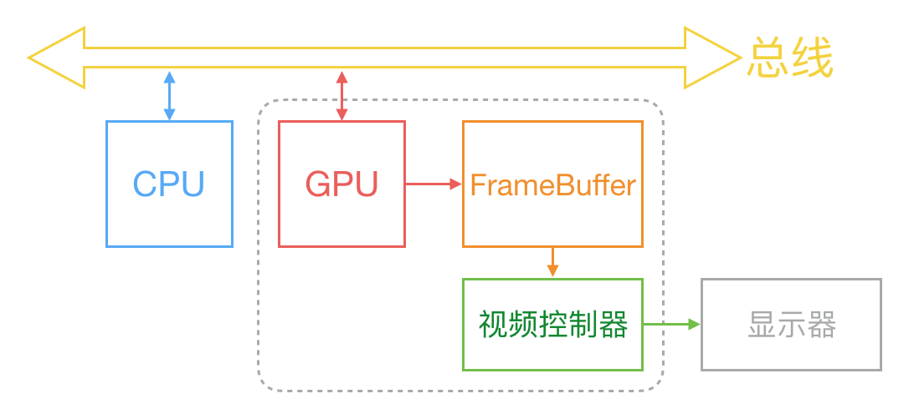

# Flutter 编译原理 、Flutter Engine 调试和Flutter脚本分析

### Flutter version 
```
Flutter (Channel stable, v1.9.1+hotfix.6, on Mac OS X 10.15.1 19B88, localezh-Hans-CN)
```

## 目录

* [移动开发方式探究](#移动平台开发方式探究)
* [Flutter架构](#Flutter架构)
* [Flutter绘制原理](#Flutter绘制原理)
* [调试Flutter Engine](#调试Flutter-Engine)
  * [编译Flutter Engine](#编译Flutter-Engine)
  * [编译Flutter Framework](#编译Flutter-Framework)
  * [Flutter.framework编译探究](#Flutter.framework编译探究)
  * [用本地Engine运行Flutter App（Android）](#用本地Engine运行Flutter-App（Android）)
  * [用本地Engine运行Flutter App（iOS）](#用本地Engine运行Flutter-App（iOS）)
* [检查二进制文件中是否包含调试信息的方法（iOS）](#检查二进制文件中是否包含调试信息的方法（iOS）)
* [xcode_backend.sh脚本分析](#xcode_backend.sh脚本分析)
* [Flutter 混合工程脚本化](#Flutter-混合工程脚本化)

## 移动平台开发方式探究

当我们开发一个手机应用程序时候，首先要决定我们的程序要在那几个平台上运行。而现在主要是手机平台就是Android和iOS。第二个我们要决定的就是如何处理我们的代码，使我们的代码运行在哪一个的平台上。对此，我们有如下选择：

- 单一平台——原生应用（iOS App or Android App），是特别为某个手机系统开发，他们运行在装载各自系统的的移动设备上
  - 优点：
    - 可访问手机所有功能（GPS、摄像头）
    - 性能更高，用户体验好，运行更加流畅，响应更加迅速
    - 能充分发挥平台特性，提供更好的动画与显示
  - 缺点：
    - 开发成本高，只支持单一平台，需要多组人员开发不同的系统的版本
    - 后续维护不方便

    
   
- 多平台

  混合应用（Hybrid）：介于web-app、native-app这两者之间的app，它虽然看上去是一个Native App，但本质上是通过native的框架加上web的内容来实现的。不同于native app需要针对不同的平台使用不同的开发语言，hybrid app允许开发者仅使用一套网页语言代码（HTML5+CSS+JavaScript），即可开发能够在不同平台上部署的类原生应用
  - 优点：
    - 支持设备广泛，
    - 只需编写web页面
    - 开发成本低
    - 内容可随时更新
  - 缺点：
    - 网络要求高
    - 上架限制
    - 性能低，用户体验差 

    

  跨平台应用：开发者使用这些框架时只需要编写一次代码，然后这些代码就能在多个平台运行
  - 优点：
    - 性能、运行流畅度和用户体验与原生应用相差不大
  - 缺点： 
    - 需要使用桥接或者其他的方式使用原生的组件和服务

    

  Flutter：Flutter 是 Google推出并开源的移动应用开发框架，主打跨平台、高保真、高性能。Flutter旨在提供每秒60帧（fps）的性能，或在能够进行120Hz更新的设备上提供120 fps的性能。开发者可以通过 Dart语言开发 App，一套代码同时运行在 iOS 和 Android，桌面，Web平台。 Flutter提供了丰富的组件、接口，开发者可以很快地为 Flutter添加 native扩展。同时 Flutter还使用 Native引擎渲染视图，这无疑能为用户提供良好的体验。总结如下：
    - 跨平台支持
    - 出色的用户界面
    - 快速加载时间和高性能
    - 高安全性和数据保护
    - 简单易用
    

## Flutter架构

简单的理解，Flutter可以被概括成三个部分：

1. Widget：
   - 在各种平台上通用的Widget，包括一些共有属性：响应用户操作、绘制、文本、各种形状和动画
   - 平台特制Widget：例如Android和iOS平台各自风格的Widget
2. Flutter Foundation Library：Flutter所有的功能与接口都基于此，基于Dart实现
3. Flutter Engine：C++编写，提供底层的渲染和底层功能

如果从更深层次来理解Flutter：
* [Flutter官方开发网站](https://flutter.dev/docs/resources/technical-overview)
  
* [Flutter System Architecture](https://docs.google.com/presentation/d/1cw7A4HbvM_Abv320rVgPVGiUP2msVs7tfGbkgdrTy0I/edit#slide=id.gbb3c3233b_0_187)
  

上面两张图详细的解释了Flutter整个架构：

1. Flutter Framework：纯Dart实现的SDK，本质上类似React在JavaScript中的作用。它为 flutter apps和frameworks提供了面向开发者的上层功能，包括绘制，动画处理，交互等。并提供了数量众多的OEM Widgets，分为Material和Cupertino两种视觉风格。

2. Flutter Engine：纯C++实现。Flutter Engine是一个可移植的，高性能的运行时。它提供了Flutter基本的核心库，包括：动画与图形渲染、文件I/O和network I/O，插件系统和Dart runtime，以及用于开发，编译和运行Flutter应用程序的Dart运行时和工具链。

   Flutter Engine的核心包括：
    - Skia，一个2D的图形渲染引擎。其前身是一个向量绘图软件，Chrome和 Android均采用 Skia作为绘图引擎。Skia提供了非常友好的 API，并且在图形转换、文字渲染、位图渲染方面都提供了友好、高效的表现。Skia是跨平台的，所以可以被嵌入到 Flutter的 iOS SDK中，而不用去研究 iOS闭源的 Core Graphics / Core Animation。**Android自带了 Skia，所以 Flutter Android SDK要比 iOS SDK小很多**

    - Dart VM提供了完整的Dart语言功能和执行环境。Dart VM还包括一个而外的库，dart:ui。dart:ui提供了对Skia和Shell的低等级的访问权限。
    - Shell，用于组合托管上述的核心工具。当然，不同的平台，对应着不同的Shell。Shells还可以绕过[Platform Channels](https://flutter.io/platform-channels/)直接与Dart代码通信
    - Text rendering

3. embedder：将Flutter Engine包装起来，供对应平台使用[ see Custom Flutter Engine Embedders](https://github.com/flutter/flutter/wiki/Custom-Flutter-Engine-Embedders)。

    Flutter Engine不会创建或管理自己的线程。相反，embedder负责为Flutter Engine创建和管理线程（及其消息循环）。embedder为Flutter Engine的task runners提供了其管理的线程。除了由embedder为engine管理的线程之外，Dart VM还拥有自己的线程池。Flutter Engine和embedder都无法访问该池中的线程。

    embedder 为engine提供了四个task runner：
    - Platform Task Runner：所有接口调用都使用该接口，长时间卡顿将会被watchdog强杀
    - UI Task Runner：负责绑定渲染相关的操作，如通知engine有帧渲染，等待下一个vsync，对创建的widget进行layout并生成layer tree，更新layer tree信息，通知处理native plugin信息，如timer，microtask，异步io操作
    - IO Task Runner：处理图片数据，为gpu渲染做准备，比如读取磁盘压缩图片的格式，将解压成gpu能处理的格式，并传给gpu，因其比较消耗性能所以单独开一个线程
    - GPU Task Runner：是用于执行gpu指令，负责将layer tree提供的信息转换为平台可执行的gpu指令，负责绘制gpu资源的管理，包括framebuffer，surface、texture、buffers
    

## Flutter绘制原理

显示器通常以固定频率进行刷新，比如 iPhone的 60Hz、iPad Pro的 120Hz。当一帧画面绘制完成后，准备画下一帧前，显示器会发出一个垂直同步信号（vertical synchronization），简称 VSync

并且一般地来说，计算机系统中，CPU、GPU和显示器以一种特定的方式协作：CPU将计算好的显示内容提交给 GPU，GPU渲染后放入帧缓冲区，随后视频控制器会按照 VSync 信号逐行读取帧缓冲区的数据，经过可能的数模转换传递给显示器显示。如下图所示：



无独有偶，Flutter也不例外。所以Flutter与React-Native、Weex之类只是扩展系统的OEM Widgets的最大区别就是在这。Flutter是自己绘制，并且不受系统的限制。

[Flutter System Architecture](https://docs.google.com/presentation/d/1cw7A4HbvM_Abv320rVgPVGiUP2msVs7tfGbkgdrTy0I/edit#slide=id.gbb3c3233b_0_187)

Flutter的图形管线：

  

首先明确一下isolate：原意是隔离的意思，类似于线程但不共享内存的独立工作程序，仅通过消息进行通信。solate直接的通信方式只能通过port，消息传递异步。实现的步骤有，初始化isolate数据结构，初始化堆内存，进入对应所在的线程运行isolate，配置port，配置消息处理机制，配置debugger，将isolate注册到全局监控器。
* UI Thread（UI Task Runner）: 
   是engine为根isolate执行所有Dart code的地方。根isolate是一种特殊的isolate，拥有使Flutter各模块相互交互的能力。engine通过在此isolate来schedule和提交 frames。
   当Flutter准备下一帧时：
    * 根isolate必须告诉engine需要渲染的帧
    * 运行的设备需要在下一个vsync通知引擎
    * 运行的设备继续等待下一个vsync
    * 当vsync到来时，engine将执行[drawFrame method](https://docs.flutter.io/flutter/widgets/WidgetsBinding/drawFrame.html)：
      * 更新动画插值器
      * 在构建阶段重建application中的widget
      * 对新建的widget进行布局，并将它们绘制到layer tree并立即提交给到engine中。这里实际上没有任何栅格化
      * 更新或重构widget 节点树


Flutter的渲染管线：

  

## 调试Flutter Engine

### <span style="color:#65B687;">#</span> 配置Flutter Engine 调试环境（macOS）
#### 首先配置如下工具：
* macOS(Xcode >= 10.0)

* `Chromium`提供的部署工具[depot_tools](http://commondatastorage.googleapis.com/chrome-infra-docs/flat/depot_tools/docs/html/depot_tools_tutorial.html#_setting_up)，里面包含gclient、gn和ninja等工具。是Google为解决Chromium源码管理问题为Chromium提供的源代码管理的一个工具。Flutter源码同步也需要依赖depot_tools工具:
    - Clone depot_tools 仓库
        ```
        git clone https://chromium.googlesource.com/chromium/tools/depot_tools.git
        ```
    - 修改 **~/.bashrc**（**zsh** 修改 **~/.zshrc**），添加`depot_tools`路径到环境变量中
        ```
        export PATH=$PATH:<这里的路径是你存放depot_tools的路径>/depot_tools 
        ``` 
        上述操作完成后**重启**命令行客户端使设置生效
* Python >= 2.7.10
* macOS下需要安装`ant`： 
    ```
    brew install ant 
    ```
* [Java JDK](https://www.oracle.com/technetwork/java/javase/overview/index.html) >= 1.8
* 命令行工具：
    - curl
    - wget
    - unzip

#### 获取Flutter Engine：
1. Fork [Flutter Engine](https://github.com/flutter/engine) 项目

2. 打开**终端**创建一个新的目录，例如：
    ```
    mkdir engine
    ```
    用来存放Flutter Engine源码

3. 进入创建好的`engine`目录下

    ```
    cd <你存放Flutter源码的路径>/engine
    ```
    创建`.gclient`文件

    ```
    touch .gclient
    ```
    添加如下内容：

    ```
    solutions = [
        {
            "managed": False,
            "name": "src/flutter",
            "url": "git@github.com:flutter/engine.git",
            "custom_deps": {},
            "deps_file": "DEPS",
            "safesync_url": "",
        },
    ]
    ```
    如果想指定flutter engine revision，则可以配置url加入@revision，如检出v1.9.1的engine版本:
    ```
    solutions = [
        {
            "managed": False,
            "name": "src/flutter",
            "url": "git@github.com:flutter/engine.git@b863200c37df4ed378042de11c4e9ff34e4e58c9",
            "custom_deps": {},
            "deps_file": "DEPS",
            "safesync_url": "",
        },
    ]
    ```
4. 如果想覆盖特定的依赖，可在custom_deps中重写，比如我想覆盖buildroot，从flutter/engine工程中的DEPS文件中可以找到buildroot对应的释放路径为src:
    ```
    'src': 'https://github.com/flutter/buildroot.git' + '@' + '5a33d6ab06fa2cc94cdd864ff238d2c58d6b7e4e',

    ```
   因此我们只需要覆盖src的dep即可完成buildroot的覆盖，如:
   ```
   solutions = [
        {
            "managed": False,
            "name": "src/flutter",
            "url": "git@github.com:flutter/engine.git@b863200c37df4ed378042de11c4e9ff34e4e58c9",
            "custom_deps": {
                "src":"https://github.com/flutter/buildroot.git@fa860b64553b54bbd715ebd2145523a4999a3b3a"
            },
            "deps_file": "DEPS",
            "safesync_url": "",
        },
    ]
   ```
    但是注意这种方式只能在首次配置好，如果你之前已经生成过，然后修改了这个配置再同步是不会生效的，你得进入到
    ```
    src/flutter
    ```
    目录执行
    ```
    git reset --hard commitID
    ```
    加上
    ```
    gclient sync --with_branch_heads --with_tags --verbose
    ```
    才会生效

    *custom_deps*: 这是一个可选的字典对象，会覆盖工程的"DEPS"文件定义的条目。一般它用作本地目录中，那些不用checkout的代码，或者让本地目录从不同位置checkout一个新的代码出来,或者checkout不同的分支、版本等
5. 执行`gclient sync`，这个操作将会fetch Flutter所有的依赖

    **该操作需要翻墙**

6. `gclient`执行完成后，会多出一个src目录：

    
    
    ```
    cd src/flutter
    ```
    然后添加upstream源(保持fork与upstream仓库同步)：

    ```
    git remote add upstream git@github.com:flutter/engine.git
    ```
 
#### 编译Flutter Engine

在构建前，我们需要保证当前的源码和我们使用的Flutter版本是兼容的，为了避免不必要的错误，我们对源码检出到我们当前使用的Flutter版本的提交上。首先我们要获得我们当前安装的Flutter Engine的提交记录：

```zsh
cat <your flutter path>/bin/internal/engine.version
```
得到Flutter Engine的提交记录：
```
2994f7e1e682039464cb25e31a78b86a3c59b695
```
然后将源码同步到上述提交上：

```zsh
cd <your flutter engine path>/src/flutter
git reset --hard 2994f7e1e682039464cb25e31a78b86a3c59b695
gclient sync --with_branch_heads --with_tags --verbose
```
也可以一开始通过修改.gclient文件：
```
solutions = [
    {
        "managed": False,
        "name": "src/flutter",
        "url": "git@github.com:flutter/engine.git@2994f7e1e682039464cb25e31a78b86a3c59b695",
        "custom_deps": {},
        "deps_file": "DEPS",
         "safesync_url": "",
     },
]
```
但是因为你之前已经生成过，所以这个配置不会生效，所以，你需要执行下面两个步骤：

* 进入src/flutter目录中，执行：
    ```
    git reset --hard commitID
    ```
    如显示：
    
    ```text
    fatal: Could not parse object
    ```
    可先执行：
    
    ```
    git fetch upstream
    ```
    然后再执行`reset`命令。
* 然后回到.gclient文件所在的目录，执行：
    ```
     gclient sync --with_branch_heads --with_tags --verbose
    ```
    才会生效。

然后进行如下操作：
1. 在`src/flutter`目录下执行（如执行过上面的操作可跳过）
    ```
    git pull upstream master
    ```
    **更新flutter源码**
2. 在`.gclient`文件所在目录下执行（如执行过上面的操作可跳过）
    ```
    gclient sync
    ```
    如果修改过commitID，需执行：
    ```
     gclient sync --with_branch_heads --with_tags --verbose
    ```
    **更新所有依赖项**
3. 生成编译文件：
   编译时可以选择两种模式，优化（默认，日常开发使用），未优化（调试engine时的模式，通过添加`--unoptimized`来实现）
   * `GN`：是一个生成`Ninja`构建文件的元构建系统
   * Ninja：在传统的 C/C++ 等项目构建时，通常会采用 make 系统使用 Makefile 文件来进行整个项目的编译构建，通过 Makefile 中指定的编译所依赖的规则使得程序的构建非常简单，并且在复杂项目中可以避免由于少部分源码修改而造成的很多不必要的重编译。但是它仍然不够好，因为其大而且复杂，有时候我们并不需要 make 那么强大的功能，相反我们需要更灵活，速度更快的编译工具。Ninja 作为一个新型的编译工具，小巧而又高效，它就是为此而生。

   **Android**：
    - arm:
        - debug：
            ```
            ./flutter/tools/gn --android 
            ./flutter/tools/gn
            ```
        - release优化：
            ```
            ./flutter/tools/gn --android --runtime-mode=release
            ninja -C out/host_release
            ```
        - release未优化：
            ```
            ninja -C out/android_release_unopt
            ninja -C out/host_release_unopt
            ```
    - arm64:
        - release优化：
             ```
            ninja -C out/android_release_arm64 
            ninja -C out/host_release_arm64
            ```
    - x86 profile非优化版:
        ```
        ./flutter/tools/gn --android --android-cpu x86 --unoptimized --runtime-mode=profile
        ./flutter/tools/gn --android-cpu x86 --unoptimized --runtime-mode=profile
        ```
    - x64:
        ```
        ./flutter/tools/gn --android --android-cpu x64 --unoptimized --runtime-mode=profile
        ./flutter/tools/gn --android-cpu x64 --unoptimized --runtime-mode=profile
        ```

   **iOS**：
    - arm64 release 未优化:
        ```
        ./flutter/tools/gn --ios --unoptimized --runtime-mode=release
        ./flutter/tools/gn --unoptimized --runtime-mode=release
        ```
    - arm profile优化: 
        ```
        ./flutter/tools/gn --ios --ios-cpu=arm --runtime-mode=profile
        ./flutter/tools/gn --ios-cpu=arm --runtime-mode=release
        ```
    - 模拟器未优化:
        ```
        ./flutter/tools/gn --ios --simulator --unoptimized
        ./flutter/tools/gn --unoptimized
        ```

4. 执行编译命令：

    **Android**：
    - arm:
        - debug：
            ```
            ninja -C out/android_debug
            ninja -C out/host_debug
            ```
        - release优化：
            ```
            ninja -C out/android_release

            ninja -C out/host_release
            ```
        - release未优化：
            ```
            ninja -C out/android_release_unopt

            ninja -C out/host_release_unopt
            ```
    - arm64:
        - release优化：
             ```
            ninja -C out/android_release_arm64

            ninja -C out/host_release_arm64
            ```
    - x86 profile非优化版:
        ```
        ninja -C out/android_profile_unopt_x86

        ninja -C out/host_profile_unopt_x86 
        ```
    - x64:
        ```
        ninja -C out/android_profile_unopt_x64

        ninja -C out/host_profile_unopt_x64
        ```

        **在MacOS下，必须要在Xcode(<= 9.4)的版本，编译android_debug_unopt_x86和android_debug_unopt。如果编译的的是x64架构则不需要。**

    **iOS**：
    - arm64未优化:
        ```
        ninja -C out/ios_release_unopt
        ninja -C out/host_release_unopt
        ```
    - arm profile优化: 
        ```
        ninja -C out/ios_profile_arm
        ninja -C out/host_profile_arm
        ```
    - 模拟器未优化:
        ```
        ninja -C out/ios_debug_sim_unopt
        ninja -C out/host_debug_unopt
        ```

    **编译完成后，在/out目录下就可以看见对应平台的代码了**：

    


#### 编译Flutter Framework
当我们需要修改Flutter Dart部分时，即Flutter Framework时。首先，我们需要下载一份flutter_framework代码：
``` 
    git clone https://github.com/flutter/flutter.git
```
然后执行更新，获取Flutter所依赖的package：
```zsh
    cd <your flutter_framework path>
    ./bin/flutter update-packages
    cd <your flutter_framework path>/packages/flutter
    ../../bin/flutter doctor
    ../../bin/flutter packages get
```
推荐使用Android Studio打开<your flutter_framework path>/packages/flutter,这个目录下的文件是我们runtime所需要的dart文件，如果你要进行定制或者bugfix，可修改该文件夹下的文件，来完成定制。
制作完成后，如果你想使用制作好的Flutter Framework，必须要在你修改的分支上打上Tag，同时按照如下两种规则，否则Flutter会找不到该framework：
    * 以v开头，跟着三位数的版本号，如v1.12.13，但是如果是hotfix版本，则会跟着hotfix的版本号，如v1.12.13+hotfix.5
    * 也可以在自己打的Tag上最多添加五位数，例如v1.12.13001。hotfix版本v1.12.13+hotfix.500001。来表示我们修改过的版本。


#### <span style="color:#65B687;">#</span> Flutter.framework编译探究（iOS）
下面我们以模拟器Debug模式为例，具体说明下是怎样把源码打包成Flutter.framework的。
当我们在src目录下执行
```zsh
./flutter/tools/gn --ios --simulator --unoptimized
```
我们看到在out目录下生成了一个文件夹`ios_debug_sim_unopt`:
  
然后我们用记事本打开`build.ninja`，搜索`Flutter.framework`，并没有任何结果。
我们看到在同目录下还有一个`toolchain.ninja`文件，作为`build.ninja`的`subninja`。打开后我们搜索发现：
```
subninja obj/flutter/shell/platform/darwin/ios/copy_and_verify_framework_headers.ninja
build Flutter.framework/Flutter: copy libFlutter.dylib || ./libFlutter.dylib.TOC
```
我们发现，`ninja`对一个叫`libFlutter.dylib`执行了`copy`规则（rule）。
找到`copy`规则（rule）：
```
rule copy
  command = ln -f ${in} ${out} 2>/dev/null || (rm -rf ${out} && cp -af ${in} ${out})
  description = COPY ${in} ${out}
```

```
ln 命令
用途
链接文件。
语法
将某个文件链接到一个文件上
ln [ -f | -n] [ -s ] SourceFile [ TargetFile ]
将一个或多个文件链接到一个目录上
ln [ -f | -n] [ -s ] SourceFile ... TargetDirectory
描述
ln 命令将在 SourceFile 参数中指定的文件链接到在 TargetFile 参数中指定的文件，或将其链接到在 TargetDirectory 参数中指定的另一个目录中的文件。在缺省情况下，ln 命令会创建硬链接。如果需要使用 ln 命令来创建符号链接，请指明 -s 标志。
符号链接是指向文件的一个间接指针；它的目录项中包含了它所链接的文件名。符号链接可能会跨越文件系统，可能指向目录。
如果正在将某个文件链接到新的名字，那么只能列出一个文件。如果链接到一个目录，那么可以列出多个文件。
TargetFile 参数是可选的。如果不指定目标文件，ln 命令会在当前的目录中创建一个新的文件。新的文件继承了指定在 SourceFile 参数中的文件名。
```
至此我们知道`Flutter.framework/Flutter`的本质就是`libFlutter.dylib`。
那么`libFlutter.dylib`又是怎么来的呢？继续搜索`toolchain.ninja`，我们发现包括`Flutter.framework/Headers`和`Flutter.framework/icudtl.dat`，`info.plist`，`Modules`等也是`copy`过来的。继续浏览我们发现了这样一条`ninja`语句：
```ninja
    build obj/flutter/shell/platform/darwin/ios/copy_framework_headers.stamp: stamp Flutter.framework/Headers/Flutter.h Flutter.framework/Headers/FlutterAppDelegate.h Flutter.framework/Headers/FlutterCallbackCache.h Flutter.framework/Headers/FlutterDartProject.h Flutter.framework/Headers/FlutterEngine.h Flutter.framework/Headers/FlutterHeadlessDartRunner.h Flutter.framework/Headers/FlutterPlatformViews.h Flutter.framework/Headers/FlutterPlugin.h Flutter.framework/Headers/FlutterPluginAppLifeCycleDelegate.h Flutter.framework/Headers/FlutterViewController.h Flutter.framework/Headers/FlutterMacros.h Flutter.framework/Headers/FlutterBinaryMessenger.h Flutter.framework/Headers/FlutterChannels.h Flutter.framework/Headers/FlutterCodecs.h Flutter.framework/Headers/FlutterTexture.h
build Flutter.framework/icudtl.dat: copy ../../third_party/icu/flutter/icudtl.dat

build obj/flutter/shell/platform/darwin/ios/copy_framework_icu.stamp: stamp Flutter.framework/icudtl.dat
rule __flutter_shell_platform_darwin_ios_copy_framework_info_plist___build_toolchain_mac_ios_clang_x64__rule
  command = python ../../flutter/build/copy_info_plist.py /Users/ws/thirdpartyLib/engine/src/flutter/shell/platform/darwin/ios/framework/Info.plist /Users/ws/thirdpartyLib/engine/src/out/ios_debug_sim_unopt/Flutter.framework/Info.plist --bitcode=false
  description = ACTION //flutter/shell/platform/darwin/ios:copy_framework_info_plist(//build/toolchain/mac:ios_clang_x64)
  restat = 1

build Flutter.framework/Info.plist: __flutter_shell_platform_darwin_ios_copy_framework_info_plist___build_toolchain_mac_ios_clang_x64__rule | ../../flutter/build/copy_info_plist.py ../../flutter/shell/platform/darwin/ios/framework/Info.plist

build obj/flutter/shell/platform/darwin/ios/copy_framework_info_plist.stamp: stamp Flutter.framework/Info.plist
build Flutter.framework/Modules/module.modulemap: copy ../../flutter/shell/platform/darwin/ios/framework/module.modulemap

build obj/flutter/shell/platform/darwin/ios/copy_framework_module_map.stamp: stamp Flutter.framework/Modules/module.modulemap
build Flutter.podspec: copy ../../flutter/shell/platform/darwin/ios/framework/Flutter.podspec

build obj/flutter/shell/platform/darwin/ios/copy_framework_podspec.stamp: stamp Flutter.podspec
build LICENSE: copy ../../LICENSE

build obj/flutter/shell/platform/darwin/ios/copy_license.stamp: stamp LICENSE
subninja obj/flutter/shell/platform/darwin/ios/create_flutter_framework_dylib.ninja
```
我们猜测可以这就是生成`libFlutter.dylib`的原因所在。打开所在目录下的`create_flutter_framework_dylib.ninja`，我们发现这样一句ninja语句：
```
libFlutter.FlutterAppDelegate.o: objcxx ../../flutter/shell/platform/darwin/ios/framework/Source/FlutterAppDelegate.mm
```
我们回到`toolchain.ninja`找到`objcxx`规则：
```
rule objcxx
  command =  ../../buildtools/mac-x64/clang/bin/clang++ -MD -MF ${out}.d ${defines} ${include_dirs} -isysroot /Applications/Xcode.app/Contents/Developer/Platforms/iPhoneSimulator.platform/Developer/SDKs/iPhoneSimulator13.2.sdk -mios-simulator-version-min=8.0  ${cflags} ${cflags_cc} ${cflags_objcc}  -c ${in} -o ${out}
  description = OBJCXX ${out}
  depfile = ${out}.d
  deps = gcc
```
至此我们发现了`ninja`是怎么生成`.o`文件的。我们继续往下寻找：
```
cflags = -fno-strict-aliasing -arch x86_64 -march=core2 -fcolor-diagnostics -Wall -Wextra -Wendif-labels -Werror -Wno-missing-field-initializers -Wno-unused-parameter -Wunguarded-availability -fvisibility=hidden -stdlib=libc++ -Wstring-conversion -Wnewline-eof -O0 -g2
cflags_objcc = -fvisibility-inlines-hidden -fobjc-call-cxx-cdtors -std=c++17 -fno-rtti -fno-exceptions
root_out_dir = .
target_out_dir = obj/flutter/shell/platform/darwin/ios
target_output_name = libFlutter
....
ldflags = -Wl,-install_name,@rpath/Flutter.framework/Flutter -arch x86_64 -march=core2 -stdlib=libc++
  libs = -framework CoreMedia -framework CoreVideo -framework UIKit -framework OpenGLES -framework AudioToolbox -framework QuartzCore -framework Foundation -ldl -framework CoreFoundation -framework CoreGraphics -framework CoreText -framework ImageIO -framework MobileCoreServices -framework Security -lpthread
  output_extension = .dylib
  output_dir = 
```
    
我们回到`toolchain.ninja`找到`solink`规则：
```
rule solink
  command = if [ ! -e ${root_out_dir}/${target_output_name}${output_extension} -o ! -e ${root_out_dir}/${target_output_name}${output_extension}.TOC ] || otool -l ${root_out_dir}/${target_output_name}${output_extension} | grep -q LC_REEXPORT_DYLIB ; then ../../buildtools/mac-x64/clang/bin/clang++ -shared -isysroot /Applications/Xcode.app/Contents/Developer/Platforms/iPhoneSimulator.platform/Developer/SDKs/iPhoneSimulator13.2.sdk -mios-simulator-version-min=8.0   -Wl,-object_path_lto,${root_out_dir}/lto_${target_output_name}.o ${ldflags} -o ${root_out_dir}/${target_output_name}${output_extension} -Wl,-filelist,${root_out_dir}/${target_output_name}${output_extension}.rsp ${solibs} ${libs} && { otool -l ${root_out_dir}/${target_output_name}${output_extension} | grep LC_ID_DYLIB -A 5; nm -gP ${root_out_dir}/${target_output_name}${output_extension} | cut -f1-2 -d' ' | grep -v U$$$$; true; } > ${root_out_dir}/${target_output_name}${output_extension}.TOC; else ../../buildtools/mac-x64/clang/bin/clang++ -shared -isysroot /Applications/Xcode.app/Contents/Developer/Platforms/iPhoneSimulator.platform/Developer/SDKs/iPhoneSimulator13.2.sdk -mios-simulator-version-min=8.0   -Wl,-object_path_lto,${root_out_dir}/lto_${target_output_name}.o ${ldflags} -o ${root_out_dir}/${target_output_name}${output_extension} -Wl,-filelist,${root_out_dir}/${target_output_name}${output_extension}.rsp ${solibs} ${libs} && { otool -l ${root_out_dir}/${target_output_name}${output_extension} | grep LC_ID_DYLIB -A 5; nm -gP ${root_out_dir}/${target_output_name}${output_extension} | cut -f1-2 -d' ' | grep -v U$$$$; true; } > ${root_out_dir}/${target_output_name}${output_extension}.tmp && if ! cmp -s ${root_out_dir}/${target_output_name}${output_extension}.tmp ${root_out_dir}/${target_output_name}${output_extension}.TOC; then mv ${root_out_dir}/${target_output_name}${output_extension}.tmp ${root_out_dir}/${target_output_name}${output_extension}.TOC ; fi; fi
  description = SOLINK ${out}
  rspfile = ${root_out_dir}/${target_output_name}${output_extension}.rsp
  rspfile_content = ${in_newline}
  restat = 1
```
到这里，整个Flutter.framework的生成过程就完全清晰了。可以对照Xcode编译动态Framework的输出来看。

**因为整个ninja文件是生成的，具体代码就不做具体分析了**


#### 用本地Engine运行Flutter App（Android）
Android使用Local Engine只要向gradle传递localEngineOut参数即可：

* 在终端中输入： 
    ```
    gradlew clean assembleDebug -PlocalEngineOut=<your flutter engine path>/src/out/android_debug_unopt

    ```
    或者
* 在gradle.properties文件中加入
    ```
    localEngineOut=<your flutter engine path>/src/out/android_debug_unopt
    ```
    如果直接使用flutter build构建方式，只需在终端中输入：
    ```
    flutter build apk --local-engine=android_debug_unopt --local-engine-src-path=<your flutter engine path>/src
    ```

#### 用本地Engine运行Flutter App（iOS）

当编译完成之后，在**终端**中打开需要调试的Flutter App所在目录：
* 方式一：

    - 在**终端**输入如下命令，运行：
        ```
        flutter run --local-engine-src-path <你本地的Flutter Engine 路径>/src --local-engine=<需要构建的版本类型，例如：ios_debug_sim_unopt> -d <运行设备的UDID，注意区分模拟器和真机>
        ```
        例如：
        ```
        flutter run --local-engine-src-path /Users/ws/thirdpartyLib/engine/src --local-engine=ios_debug_sim_unopt -d 8C719016-C1F7-409E-9912-5B1475BF854A
        ```

    - 用Xcode打开需要调试的Flutter App，在Xcode顶部Debug>Attach to Process>找到对应运行的进程名和进程id，就可以调试通过flutter run跑起来的项目了：

        
* 方式二：

    1. 使用Xcode打开Flutter App，找到Generated.xcconfig文件，打开：

        - 修改FLUTTER_FRAMEWORK_DIR=<你本地Flutter Engine/src/out目录下对应平台的路径，例如：
            ```
            FLUTTER_FRAMEWORK_DIR=<本地engine路径>/src/out/ios_debug_sim_unopt
            ```

        - 添加FLUTTER_ENGINE=<本地engine路径>/src

        - 添加LOCAL_ENGINE=对应平台的Engine，例如：
            ```
            FLUTTER_FRAMEWORK_DIR=ios_debug_sim_unopt
            ```

        - 添加ARCHS=支持的处理器类型，例如：
            ```
            ARCHS=arm64
            ```
        - **组合起来：**

            ```
            // This is a generated file; do not edit or check into version control.
            ...
            FLUTTER_FRAMEWORK_DIR=<本地engine路径>/src/out/ios_debug_sim_unopt
            FLUTTER_ENGINE=<本地engine路径>/src
            LOCAL_ENGINE=ios_debug_sim_unopt
            ARCHS=arm64
            ...
            ```
    2. 点击Xcode Run按钮或者CMD+r，运行项目

    **在<本地engine路径>/src/out目录下，打开对应平台的Engine源码，例如在out/ios_debug_sim_unopt下，打开 all.xcworkspace，找到你要调试的方法名称，通过lldb命令在运行的Flutter App中设置断点，例如**

    ```
    br set -n viewDidLoad 就是对所有的viewDidLoad设置了断点
    ```

### <span style="color:#65B687;">#</span> 检查二进制文件中是否包含调试信息的方法（iOS）

首先我们初始化一个Flutter项目，命名为`testflutter`，用Xcode打开后，编译，进入到
```
<your flutter project>/ios/Flutter/Flutter.framework
```
目录，然后开始lldb：
  

同样我们来到Engine目录下，我这里使用的是模拟器，所以进入到
```
<your engine path>/src/out/ios_debug_sim_unopt/Flutter.framework
```
目录下，开始lldb：
  
可以看到我们自己用Engine编译生成的Flutter.framework就可以找到源码。而我们安装的Flutter中的引擎却不能输出源码路径。那么当我们调试Engine的时候，LLDB是怎样找到Flutter Engine的源码的？

在Mac OS X上，当我们链接一个程序的时候，链接器(ld)不会处理所有的调试信息。因为调试信息通常是程序可执行文件大小的10倍以上，因此让链接器处理所有调试信息并将其包含在可执行二进制文件中是对链接时间的严重损害。

所以由编译器在.s文件中生成DWARF调试信息，汇编程序在.o文件中输出调试信息，并且链接程序在可执行二进制文件中包含`debug map`。在链接期间通过`debug map`来重新定位符号信息。

在调试时（.o调试）从可执行文件中加载`debug map`，链接其中的`DWARF`（DWARF是一种被众多编译器和调试器使用的用于支持源代码级别调试的调试文件格式）。根据`debug map`重新映射符号信息。

`dsymutil`可以被理解为是调试信息链接器。它按照上面的步骤执行：

    - 读取`debug map`
    - 从.o文件中加载DWARF
    - 重新定位所有地址
    - 最后将全部的`DWARF`打包成`dSYM Bundle`

有了dSYM后，我们就拥有了最标准的`DWARF`的文件，任何可以dwarf读取工具（可以处理Mach-O二进制文件）都可以处理该标准DWARF。

链接器每次创建二进制文件时，都会在LC_UUID加载命令（otool -hlv或dwarfdump --uuid）中发出一个128位的UUID。这表示了该二进制文件唯一标识。当`dsymutil`创建`dSYM`时也包括了UUID。如果调试器具有匹配的UUID，则它们会将dSYM与可执行文件相关联。

如果我们想查看`debug map`，可以通过如下命令：
```zsh
nm -pa executable
```

总结一下。在Mac OS X上，编译器将调试信息写入.o文件，并在最终生成的二进制文件中写入一个`debug map`，用来告诉lldb如何查找.o文件并链接其中的`DWARF`（DWARF是一种被众多编译器和调试器使用的用于支持源代码级别调试的调试文件格式）。所以如果在DEBUG环境下，未移动或删除用.o文件或这些.o文件的源文件，就不需要dSYM文件。但是，如过删除了.o文件，或者在使用前剥离了这块信息，那么lldb就无法追踪下去了。

我们不对Mach-o文件的一些具体细节来分析，仅针对调试这方面来分析。下面我们就动态库和静态库分别来理解：

- 首先我们准备好测试代码

    进入到测试文件夹内，新建`testLib.c`
      
    无论是动态库还是静态库都是由.o文件创建的。所以我们先将`testLib.c`转化为`testLib.o`
    ```
    xcrun clang -c testLib.c -o testLib.o
    ```
    `clang –o`是将.c源文件编译成为一个可执行的二进制代码(-o选项其实是制定输出文件文件名，如果不加-c选项，clang默认会编译链接生成可执行文件，文件的名称由-o选项指定)。 

    `clang –c`是使用LLVM汇编器将源文件转化为目标代码。这时，只调用了C编译器（clang-cl）和汇编器（llvm-as），而链接器(llvm-ld)并没有被执行。所以输出的目标文件不会包含Unix程序在被装载和执行时所必须的包含信息，但它以后可以被链接到一个程序。

    如果我们需要在.o中生成调试信息，需要添加`-g`参数：
    
    ```
    xcrun clang -g -c testLib.c -o testLib.o
    ```
    - 不添加`-g`参数：
      
        可以看到不存在编译单元。
    - 添加`-g`参数：
      
- 创建静态链接库

  ```
  libtool -static -arch_only x86_64 testLib.o -o /Users/ws/Desktop/lib/TestLib/staticLib/testLib
  ```
  进入到staticLib文件内：

    
- 创建动态链接库

  ```
  xcrun clang -target x86_64 -dynamiclib testLib.o -o /Users/ws/Desktop/lib/TestLib/dynamic/testLib
  ```
  进入到dynamicLib文件内：
    

首先我们知道静态实际上是.o文件的集合。按照上面我们对调试信息的分析，我们删除.o文件后再来观察:

- 静态库：
    
    可以看到并没有变化
- 动态库：
    
    虽然存在编译单元，但是却已经打印不出源码地址。

我们在观察删除了.o文件在静态库和动态库的输出后，更加证实了我们上面的说明。

我们也可已通过Xcode来做更加完整的测试，新建一个framework项目，然后分别做静态库和动态库编译，然后通过查看编译输出，删除.o文件。将编译好的framework引入到具体的测试项目，通过lldb调试，来观察是否能跳进framework源码。然后在删除framework源码后看是否还能显示源码。
**提示**：静态库如果删除源码就不会进入源码。动态库如果删除.o文件调试时就不会进入源码，当然还有其他的方式。
**提示**：对于`strip`后的二进制文件，我们还要进行具体的分析，这里就不展开讲了。

如此，我们可以这样考虑一下，当我们进行二进制化时。如果我们在项目里使用的是二进制，虽然会给工程带来构建速度的提升，但是会带来一个新的问题：在调试工程时，那些使用二进制的组件，无法像源码调试那样看到足够丰富的调试信息。目前大部分的解决办法，是通过在pod中配置不同的参数，在调试的时候再切换成源码。所以，按照我们的分析，在调试静态库时就可以将对应的源码下载到二进制文件中保存的文件路径，然后我们就可以看到更详细的调试信息了。（这里如何保存的也需要做具体分析，也不展开讲了）


### <span style="color:#65B687;">#</span> 补充
**可通过如下命令获取连接设备的UDID**
```
flutter devices
```
### xcode_backend.sh脚本分析
#### Generated.xcconfig
```zsh
// This is a generated file; do not edit or check into version control.
FLUTTER_ROOT=/Users/ws/thirdpartyLib/flutter
FLUTTER_APPLICATION_PATH=/Users/ws/Desktop/lib/testflutter
FLUTTER_TARGET=/Users/ws/Desktop/lib/testflutter/lib/main.dart
FLUTTER_BUILD_DIR=build
SYMROOT=${SOURCE_ROOT}/../build/ios
FLUTTER_FRAMEWORK_DIR=/Users/ws/thirdpartyLib/engine/src/out/ios_debug_sim_unopt
FLUTTER_BUILD_NAME=1.0.0
FLUTTER_BUILD_NUMBER=1
FLUTTER_ENGINE=/Users/ws/thirdpartyLib/engine/src
LOCAL_ENGINE=ios_debug_sim_unopt
ARCHS=arm64
```
```zsh
#!/bin/bash 
#符号#!用来告诉系统它后面的参数是用来执行该文件的程序。在这个例子中我们使用/bin/sh来执行程序
# Copyright 2016 The Chromium Authors. All rights reserved.
# Use of this source code is governed by a BSD-style license that can be
# found in the LICENSE file.
#定义RunCommand 带参函数
RunCommand() {
  #判断全局字符串VERBOSE_SCRIPT_LOGGING是否为空。-n string判断字符串是否非空
  #[[是 bash 程序语言的关键字。用于判断
  if [[ -n "$VERBOSE_SCRIPT_LOGGING" ]]; then
    #作为一个字符串输出所有参数。使用时加引号"$*" 会将所有的参数作为一个整体，以"$1 $2 … $n"的形式输出所有参数
    echo "♦ $*"  
  fi
  #与$*相同。但是使用时加引号，并在引号中返回每个参数。"$@" 会将各个参数分开，以"$1" "$2" … "$n" 的形式输出所有参数
  "$@"
  #显示最后命令的退出状态。0表示没有错误，其他任何值表明有错误。
  return $?
}

# When provided with a pipe by the host Flutter build process, output to the
# pipe goes to stdout of the Flutter build process directly.

StreamOutput() {
  #判断是否配置全局变量SCRIPT_OUTPUT_STREAM_FILE（文件输出路径）
  if [[ -n "$SCRIPT_OUTPUT_STREAM_FILE" ]]; then
    #如果配置了，就将参数$1 写入该文件中
    echo "$1" > $SCRIPT_OUTPUT_STREAM_FILE
  fi
}

EchoError() {
    #在shell脚本中，默认情况下，总是有三个文件处于打开状态，标准输入(键盘输入)、标准输出（输出到屏幕）、标准错误（也是输出到屏幕），它们分别对应的文件描述符是0，1，2
    # >  默认为标准输出重定向，与 1> 相同
    # 2>&1  意思是把 标准错误输出 重定向到 标准输出.
    # &>file  意思是把标准输出 和 标准错误输出 都重定向到文件file中

    # 1>&2 将标准输出重定向到标准错误输出。实际上就是打印所有参数已标准错误格式
  echo "$@" 1>&2
}

# 验证路径中的资源是否存在
AssertExists() {
  # -e filename 如果 filename存在，则为真。!通常它代表反逻辑的作用。判断第二个参数$1表示的文件名存不存在
  if [[ ! -e "$1" ]]; then
    # -h filename 判断文件是否是一个符号链接。判断参数$1是否表示的符号链接
    if [[ -h "$1" ]]; then
      EchoError "The path $1 is a symlink to a path that does not exist"
    else
      EchoError "The path $1 does not exist"
    fi
    exit -1
  fi
  return 0
}

BuildApp() {
  #定义一个字符串变量project_path
  local project_path="${SOURCE_ROOT}/.."
  # eg SOURCE_ROOT = /Users/ws/Desktop/lib/testflutter/ios
  # eg: project_path = /Users/ws/Desktop/lib/testflutter/ios/..
  # eg: FLUTTER_APPLICATION_PATH = /Users/ws/Desktop/lib/testflutter
  #判断FLUTTER_APPLICATION_PATH代表的字符串是否为空
  if [[ -n "$FLUTTER_APPLICATION_PATH" ]]; then
    #不为空，project_path = FLUTTER_APPLICATION_PATH
    project_path="${FLUTTER_APPLICATION_PATH}"
  fi

  local target_path="lib/main.dart"
  if [[ -n "$FLUTTER_TARGET" ]]; then
    # eg: FLUTTER_TARGET = /Users/ws/Desktop/lib/testflutter/lib/main.dart
    target_path="${FLUTTER_TARGET}"
  fi

  # eg derived_dir = /Users/ws/Desktop/lib/testflutter/ios/Flutter
  local derived_dir="${SOURCE_ROOT}/Flutter"
  #如果${project_path}/.ios文件存在
  if [[ -e "${project_path}/.ios" ]]; then
    # derived_dir = /Users/ws/Desktop/lib/testflutter/.ios/Flutter
    derived_dir="${project_path}/.ios/Flutter"
  fi

  # 默认的assets_path = flutter_assets
  local assets_path="flutter_assets"
  # assets_path可以通过对AppFrameworkInfo.plist中添加FLTAssetsPath 键值对被重新赋值

  # 在 bash shell 中，$( ) 与` ` (反引号) 都是用来做命令替换用(commandsubstitution)的。
  #所以这一段会先执行括号内的命令，然后执行的结果会替换整个$( ) 的内容
  # PlistBuddy则是Mac自带的专门解析plist的小工具
  # 由于PlistBuddy并不在Mac默认的Path里，所以我们得通过绝对路径来引用这个工具： /usr/libexec/PlistBuddy --help
  # 这段实际的意思就是：获取${derived_dir}/AppFrameworkInfo.plist中FLTAssetsPath代表的字符串，将其赋值给assets_path
  FLTAssetsPath=$(/usr/libexec/PlistBuddy -c "Print :FLTAssetsPath" "${derived_dir}/AppFrameworkInfo.plist" 2>/dev/null)
  if [[ -n "$FLTAssetsPath" ]]; then
    assets_path="${FLTAssetsPath}"
  fi
  
  # eg: ${var:-word} 如果变量 var 为空或已被删除(unset)，那么返回 word，但不改变 var 的值
  # 判断FLUTTER_BUILD_MODE是否为空。为空就获取CONFIGURATION表示的值。
  # |tr "[:upper:]" "[:lower:] 意思就是将大写转换成小写字符
  local build_mode="$(echo "${FLUTTER_BUILD_MODE:-${CONFIGURATION}}" | tr "[:upper:]" "[:lower:]")"
  local artifact_variant="unknown"
  # case是多分支语句判断
  # 对*)的几点说明：
  # case in 语句中的*)用来“托底”，万一 expression 没有匹配到任何一个模式，*)部分可以做一些“善后”工作，或者给用户一些提示。
  # 可以没有*)部分。如果 expression 没有匹配到任何一个模式，那么就不执行任何操作。
  # 除最后一个分支外（这个分支可以是普通分支，也可以是*)分支），其它的每个分支都必须以;;结尾，;;代表一个分支的结束，不写的话会有语法错误。最后一个分支可以写;;，也可以不写，因为无论如何，执行到 esac 都会结束整个 case in 语句。
  # *release*的 * *代表通配符，表示只要包含release字符串就往下执行
  case "$build_mode" in
    *release*) build_mode="release"; artifact_variant="ios-release";;
    *profile*) build_mode="profile"; artifact_variant="ios-profile";;
    *debug*) build_mode="debug"; artifact_variant="ios";;
    *)
      EchoError "========================================================================"
      EchoError "ERROR: Unknown FLUTTER_BUILD_MODE: ${build_mode}."
      EchoError "Valid values are 'Debug', 'Profile', or 'Release' (case insensitive)."
      EchoError "This is controlled by the FLUTTER_BUILD_MODE environment variable."
      EchoError "If that is not set, the CONFIGURATION environment variable is used."
      EchoError ""
      EchoError "You can fix this by either adding an appropriately named build"
      EchoError "configuration, or adding an appropriate value for FLUTTER_BUILD_MODE to the"
      EchoError ".xcconfig file for the current build configuration (${CONFIGURATION})."
      EchoError "========================================================================"
      exit -1;;
  esac

  # Archive builds (ACTION=install) should always run in release mode.
  # ACTION == install的话，build_mode必须是release
  if [[ "$ACTION" == "install" && "$build_mode" != "release" ]]; then
    EchoError "========================================================================"
    EchoError "ERROR: Flutter archive builds must be run in Release mode."
    EchoError ""
    EchoError "To correct, ensure FLUTTER_BUILD_MODE is set to release or run:"
    EchoError "flutter build ios --release"
    EchoError ""
    EchoError "then re-run Archive from Xcode."
    EchoError "========================================================================"
    exit -1
  fi

  # 获取framework_path的路径
  # eg: framework_path = /Users/ws/thirdpartyLib/flutter/bin/cache/artifacts/engine/ios
  local framework_path="${FLUTTER_ROOT}/bin/cache/artifacts/engine/${artifact_variant}"
  # 判断framework是否存在
  AssertExists "${framework_path}"
  # 判断project是否存在
  AssertExists "${project_path}"
  # 创建derived_dir路径。mkdir -p , --parents 需要时创建上层目录，如目录早已存在则不当作错误
  RunCommand mkdir -p -- "$derived_dir"
  # 判断是否创建成功
  AssertExists "$derived_dir"
  # 删除derived_dir下面的App.framework
  RunCommand rm -rf -- "${derived_dir}/App.framework"
  
  local flutter_engine_flag=""
  local local_engine_flag=""
  # eg: flutter_framework = /Users/ws/thirdpartyLib/flutter/bin/cache/artifacts/engine/ios/Flutter.framework
  local flutter_framework="${framework_path}/Flutter.framework"
  # eg: flutter_framework = /Users/ws/thirdpartyLib/flutter/bin/cache/artifacts/engine/ios/Flutter.podspec
  local flutter_podspec="${framework_path}/Flutter.podspec"
  
  # 如果FLUTTER_ENGINE变量存在
  if [[ -n "$FLUTTER_ENGINE" ]]; then
    # eg: flutter_engine_flag = --local-engine-src-path=/Users/ws/thirdpartyLib/engine/src
    flutter_engine_flag="--local-engine-src-path=${FLUTTER_ENGINE}"
  fi
 
  local bitcode_flag=""
  # 判断LOCAL_ENGINE字符串是否为空
  if [[ -n "$LOCAL_ENGINE" ]]; then
    # 判断LOCAL_ENGINE表示的小写字符串是否包含build_mode表示的字符串
    # eg: LOCAL_ENGINE=ios_debug_sim_unopt, build_mode="debug"
    if [[ $(echo "$LOCAL_ENGINE" | tr "[:upper:]" "[:lower:]") != *"$build_mode"* ]]; then
      EchoError "========================================================================"
      EchoError "ERROR: Requested build with Flutter local engine at '${LOCAL_ENGINE}'"
      EchoError "This engine is not compatible with FLUTTER_BUILD_MODE: '${build_mode}'."
      EchoError "You can fix this by updating the LOCAL_ENGINE environment variable, or"
      EchoError "by running:"
      EchoError "  flutter build ios --local-engine=ios_${build_mode}"
      EchoError "or"
      EchoError "  flutter build ios --local-engine=ios_${build_mode}_unopt"
      EchoError "========================================================================"
      exit -1
    fi
    # eg: local_engine_flag = --local-engine=ios_debug_sim_unopt
    local_engine_flag="--local-engine=${LOCAL_ENGINE}"
    # flutter_framework = /Users/ws/thirdpartyLib/engine/src/out/ios_debug_sim_unopt/Flutter.framework
    flutter_framework="${FLUTTER_ENGINE}/out/${LOCAL_ENGINE}/Flutter.framework"
    # flutter_podspec = /Users/ws/thirdpartyLib/engine/src/out/ios_debug_sim_unopt/Flutter.podspec
    flutter_podspec="${FLUTTER_ENGINE}/out/${LOCAL_ENGINE}/Flutter.podspec"
    fi
  if [[ $ENABLE_BITCODE == "YES" ]]; then
    bitcode_flag="--bitcode"
  fi
  
  # eg: /Users/ws/Desktop/lib/testflutter/.ios 存在
  if [[ -e "${project_path}/.ios" ]]; then
    # 删除${derived_dir}/engine下的所有内容
    RunCommand rm -rf -- "${derived_dir}/engine"
    # 重建${derived_dir}/engine目录
    mkdir "${derived_dir}/engine"
    # copy flutter_podspec和flutter_framework 到 ${derived_dir}/engine目录下
    RunCommand cp -r -- "${flutter_podspec}" "${derived_dir}/engine"
    RunCommand cp -r -- "${flutter_framework}" "${derived_dir}/engine"
    # find命令 -type 查找某一类型的文件 后面根文件类型 f代表普通文件
    # find 命令 -exec： find命令对匹配的文件执行该参数所给出的shell命令。相应命令的形式为'command' { } ;，注意{ }和\;之间的空格。
    # chmod a-w 取消目录下的所有文件可写权限 
    # 找到Flutter.framework，取消可写权限
    RunCommand find "${derived_dir}/engine/Flutter.framework" -type f -exec chmod a-w "{}" \;
  else
    # 删除${derived_dir}/Flutter.framework，并copy flutter_framework到${derived_dir}路径下
    RunCommand rm -rf -- "${derived_dir}/Flutter.framework"
    RunCommand cp -r -- "${flutter_framework}" "${derived_dir}"
    # 找到Flutter.framework，取消可写权限
    RunCommand find "${derived_dir}/Flutter.framework" -type f -exec chmod a-w "{}" \;
  fi

  # /dev/null 的作用是将标准输出1重定向到/dev/null中。在类Unix系统中是一个特殊的设备文件，它丢弃一切写入其中的数据（但报告写入操作成功），因此被称为比特桶或者黑洞。
  # pushd命令常用于将目录加入到栈中，加入记录到目录栈顶部，并切换到该目录；若pushd命令不加任何参数，则会将位于记录栈最上面的2个目录对换位置
  # 实际上就是进入到${project_path}目录
  RunCommand pushd "${project_path}" > /dev/null

  AssertExists "${target_path}"

  local verbose_flag=""
  if [[ -n "$VERBOSE_SCRIPT_LOGGING" ]]; then
    # 详细的日志输出
    verbose_flag="--verbose"
  fi
  # FLUTTER_BUILD_DIR是否为空，为空使用build代替
  local build_dir="${FLUTTER_BUILD_DIR:-build}"

  #是否检测weidget的创建，release模式不支持此参数
  local track_widget_creation_flag=""
  if [[ -n "$TRACK_WIDGET_CREATION" ]]; then
    track_widget_creation_flag="--track-widget-creation"
  fi
  # ${build_mode}不是debug的话
  if [[ "${build_mode}" != "debug" ]]; then
    # 调用StreamOutput函数
    StreamOutput " ├─Building Dart code..."
    
    # eg: ${string//substring/replacement}                使用$replacement, 代替所有匹配的$substring
    # 将ARCHS表示的字符串中的空格替换成,
    local archs="${ARCHS// /,}"

    # =~是正则表达式匹配
    # 检查archs变量是否包含 i386 或者x86_64，如果是打印错误日志，并退出
    if [[ $archs =~ .*i386.* || $archs =~ .*x86_64.* ]]; then
      EchoError "========================================================================"
      EchoError "ERROR: Flutter does not support running in profile or release mode on"
      EchoError "the Simulator (this build was: '$build_mode')."
      EchoError "You can ensure Flutter runs in Debug mode with your host app in release"
      EchoError "mode by setting FLUTTER_BUILD_MODE=debug in the .xcconfig associated"
      EchoError "with the ${CONFIGURATION} build configuration."
      EchoError "========================================================================"
      exit -1
    fi

    # 执行flutter的编译命令下，可以通过在终端中输入 flutter --help查看
    RunCommand "${FLUTTER_ROOT}/bin/flutter" --suppress-analytics           \
      ${verbose_flag}                                                       \
      build aot                                                             \
      --output-dir="${build_dir}/aot"                                       \
      --target-platform=ios                                                 \
      --target="${target_path}"                                             \
      --${build_mode}                                                       \
      --ios-arch="${archs}"                                                 \
      ${flutter_engine_flag}                                                \
      ${local_engine_flag}                                                  \
      ${bitcode_flag}

    # $?上个命令的退出状态，或函数的返回值。0表示没有错误，其他任何值表明有错误。
    # -ne 不等于则为真
    # flutter命令的运行结果是否存在错误
    if [[ $? -ne 0 ]]; then
      EchoError "Failed to build ${project_path}."
      exit -1
    fi
    StreamOutput "done"

    local app_framework="${build_dir}/aot/App.framework"

    RunCommand cp -r -- "${app_framework}" "${derived_dir}"

    # build_mode = release
    if [[ "${build_mode}" == "release" ]]; then
      StreamOutput " ├─Generating dSYM file..."
      # Xcode calls `symbols` during app store upload, which uses Spotlight to
      # find dSYM files for embedded frameworks. When it finds the dSYM file for
      # `App.framework` it throws an error, which aborts the app store upload.
      # To avoid this, we place the dSYM files in a folder ending with ".noindex",
      # which hides it from Spotlight, https://github.com/flutter/flutter/issues/22560.
      # 创建dsym文件夹
      RunCommand mkdir -p -- "${build_dir}/dSYMs.noindex"
      # xcrun 是 Xcode 基本的命令行工具。使用它可以调用其他工具。xcrun --help
      # dsymutil使用其符号表中包含的调试符号信息链接在目标文件中找到的DWARF调试信息，以获取可执行文件。默认情况下，链接的调试信息放在与可执行文件同名的.dSYM包中。
      # -o <filename>指定path放置dSYM包的备用项。通过附加.dSYM到可执行文件名来创建默认的dSYM软件包路径
      # 实际上就是将${app_framework}/App生成DSYM的文件剥离出来
      RunCommand xcrun dsymutil -o "${build_dir}/dSYMs.noindex/App.framework.dSYM" "${app_framework}/App"
      # 同上
      if [[ $? -ne 0 ]]; then
        EchoError "Failed to generate debug symbols (dSYM) file for ${app_framework}/App."
        exit -1
      fi
      StreamOutput "done"

      StreamOutput " ├─Stripping debug symbols..."
      # strip工具就是把生成的 对象文件 中不必要的 符号（symbols）去掉
      # -x 删除大多数本地符号
      # -S 删除整个debugging符号表
      RunCommand xcrun strip -x -S "${derived_dir}/App.framework/App"
      # 实际上strip和dsymutil最主要做的就是在release模式下，帮助App.framework瘦身
    
      if [[ $? -ne 0 ]]; then
        EchoError "Failed to strip ${derived_dir}/App.framework/App."
        exit -1
      fi
      StreamOutput "done"
    fi

  else
    RunCommand mkdir -p -- "${derived_dir}/App.framework"

    # Build stub for all requested architectures.
    local arch_flags=""
    # read命令 -a(数组变量) -r(取消反义符作用)
    # <<< 就是将后面的内容作为前面命令的标准输入
    read -r -a archs <<< "$ARCHS"
    # 遍历archs数组
    for arch in "${archs[@]}"; do
      arch_flags="${arch_flags}-arch $arch "
    done

    # | 管道 (pipeline)
    #pipeline 是 UNIX 系统，基础且重要的观念。连结上个指令的标准输出，做为下个指令的标准输入。
    # -x 编译语言比如objective-c，这是是指明编译语言为c
    # -arch 编译的架构，比如arm7，eg： arch_flags = -arch arm7
    # -dynamiclib 表示将编译成一个动态库
    # -fembed-bitcode-marker只是简单的标记一下在archive出来的二进制中bitcdoe所在的位置
    # -Xlinker 传递参数给链接器，要传递两个参数需要分开写两次“Xlinker”
    # -Xlinker -rpath -Xlinker <path> 在链接的时候直接将搜索路径记录到生成的可执行程序中。UNIX下在链接共享库的时候可以通过rpath选项来指定运行时共享库加载路径。
    # -install_name 用来在运行时查找并引用该动态库。只有动态库才有install_name，应用程序如果引用了某一个动态库，则会在链接时记录该动态库的install_name。在链接时，是可以为动态库指定一个install_name。
    # -o 用于指定生成的动态库的名称
    # 一个应用程序只有一个@executable_path/，可能有多个@loader_path/。@executable_path/表示应用程序执行时路径。@loader_path/表示动态库（包括应用程序）加载时路径。程序执行时，这两个路径由系统赋值。然而@rpath/则是由用户随意赋值，比前者更为灵活，可以设置多个路径。
    # - 单独使用 - 符号，不加任何该加的文件名称时，代表"标准输入"的意思
    RunCommand eval "$(echo "static const int Moo = 88;" | xcrun clang -x c \
        ${arch_flags} \
        -dynamiclib \
        -fembed-bitcode-marker \
        -Xlinker -rpath -Xlinker '@executable_path/Frameworks' \
        -Xlinker -rpath -Xlinker '@loader_path/Frameworks' \
        -install_name '@rpath/App.framework/App' \
        -o "${derived_dir}/App.framework/App" -)"
  fi

  local plistPath="${project_path}/ios/Flutter/AppFrameworkInfo.plist"
  if [[ -e "${project_path}/.ios" ]]; then
    plistPath="${project_path}/.ios/Flutter/AppFrameworkInfo.plist"
  fi

  RunCommand cp -- "$plistPath" "${derived_dir}/App.framework/Info.plist"

  local precompilation_flag=""
  if [[ "$CURRENT_ARCH" != "x86_64" ]] && [[ "$build_mode" != "debug" ]]; then
    precompilation_flag="--precompiled"
  fi

  StreamOutput " ├─Assembling Flutter resources..."
  # 编译 资源包，若是debug模式则会包含flutter代码的JIT编译快照，此时app.framework中不含dart代码
  RunCommand "${FLUTTER_ROOT}/bin/flutter"     \
    ${verbose_flag}                                                         \
    build bundle                                                            \
    --target-platform=ios                                                   \
    --target="${target_path}"                                               \
    --${build_mode}                                                         \
    --depfile="${build_dir}/snapshot_blob.bin.d"                            \
    --asset-dir="${derived_dir}/App.framework/${assets_path}"               \
    ${precompilation_flag}                                                  \
    ${flutter_engine_flag}                                                  \
    ${local_engine_flag}                                                    \
    ${track_widget_creation_flag}

  # 同上
  if [[ $? -ne 0 ]]; then
    EchoError "Failed to package ${project_path}."
    exit -1
  fi
  StreamOutput "done"
  StreamOutput " └─Compiling, linking and signing..."

  # popd不带任何参数执行的效果，就是将目录栈中的栈顶元素出栈。也就是切换到pushd之前的目录
  RunCommand popd > /dev/null

  echo "Project ${project_path} built and packaged successfully."
  return 0
}

# 获取framework_dir的路径
# 读取Info.plist中CFBundleExecutable字段
# 输出
GetFrameworkExecutablePath() {
  local framework_dir="$1"

  local plist_path="${framework_dir}/Info.plist"
  local executable="$(defaults read "${plist_path}" CFBundleExecutable)"
  echo "${framework_dir}/${executable}"
}


# 读取archs 参数
# 获取下可执行文件的info信息
# 如果 可执行文件是 not-fat文件，但是却不是arch变量里面的及结构体，输出错误 。要是是not fat 并且和arch一样，校验文件
# 执行lipo 命令 将该结构体输出到执行文件
#  执行成功，保存输出文件路径到all_executables.不成功退出
# 循环结束后，读取all_executables 中的结构体
# lipo 合并所有的结构体 到merged 变量
# copy merged 路径下的文件到可执行程序应该的位置
# 删除中间生成的all_executables 中的文件

LipoExecutable() {
  local executable="$1"
  shift
  # Split $@ into an array.
  read -r -a archs <<< "$@"

  # Extract architecture-specific framework executables.
  local all_executables=()
  for arch in "${archs[@]}"; do
    local lipo_info="$(lipo -info "${executable}")"
    if [[ "${lipo_info}" == "Non-fat file:"* ]]; then
      if [[ "${lipo_info}" != *"${arch}" ]]; then
        echo "Non-fat binary ${executable} is not ${arch}. Running lipo -info:"
        echo "${lipo_info}"
        exit 1
      fi
    else
      lipo -output "${output}" -extract "${arch}" "${executable}"
      if [[ $? == 0 ]]; then
        all_executables+=("${output}")
      else
        echo "Failed to extract ${arch} for ${executable}. Running lipo -info:"
        lipo -info "${executable}"
        exit 1
      fi
    fi
  done

  # Generate a merged binary from the architecture-specific executables.
  # Skip this step for non-fat executables.
  if [[ ${#all_executables[@]} > 0 ]]; then
    local merged="${executable}_merged"
    lipo -output "${merged}" -create "${all_executables[@]}"
    cp -f -- "${merged}" "${executable}" > /dev/null
    rm -f -- "${merged}" "${all_executables[@]}"
  fi
}


ThinFramework() {
  local framework_dir="$1"
  # shift命令用于对参数的移动(左移)，通常用于在不知道传入参数个数的情况下依次遍历每个参数然后进行相应处理（常见于Linux中各种程序的启动脚本。比如shift 3表示原来的4现在变成1,原来的5现在变成2等等,原来的1、2、3丢弃,0不移动
  shift

  local plist_path="${framework_dir}/Info.plist"
  local executable="$(GetFrameworkExecutablePath "${framework_dir}")"
  LipoExecutable "${executable}" "$@"
}

ThinAppFrameworks() {
  local app_path="${TARGET_BUILD_DIR}/${WRAPPER_NAME}"
  local frameworks_dir="${app_path}/Frameworks"
  # -d filename 如果 filename为目录，则为真 [ -d /tmp/mydir ]
  [[ -d "$frameworks_dir" ]] || return 0
  # 找到${app_path}下所有framework路径
  # 读取路径，调用ThinFramework函数
  find "${app_path}" -type d -name "*.framework" | while read framework_dir; do
    ThinFramework "$framework_dir" "$ARCHS"
  done
}

# 主要做了这几件事：
# 复制flutter_asserts到app包
# 复制Flutter引擎到app包
# 复制dart代码编译产物app.framework到app包
# 签名两个framework
EmbedFlutterFrameworks() {
  AssertExists "${FLUTTER_APPLICATION_PATH}"

  # Prefer the hidden .ios folder, but fallback to a visible ios folder if .ios
  # doesn't exist.
  local flutter_ios_out_folder="${FLUTTER_APPLICATION_PATH}/.ios/Flutter"
  local flutter_ios_engine_folder="${FLUTTER_APPLICATION_PATH}/.ios/Flutter/engine"
  if [[ ! -d ${flutter_ios_out_folder} ]]; then
    flutter_ios_out_folder="${FLUTTER_APPLICATION_PATH}/ios/Flutter"
    flutter_ios_engine_folder="${FLUTTER_APPLICATION_PATH}/ios/Flutter"
  fi

  AssertExists "${flutter_ios_out_folder}"

  # Embed App.framework from Flutter into the app (after creating the Frameworks directory
  # if it doesn't already exist).
  local xcode_frameworks_dir=${BUILT_PRODUCTS_DIR}"/"${PRODUCT_NAME}".app/Frameworks"
  RunCommand mkdir -p -- "${xcode_frameworks_dir}"
  RunCommand cp -Rv -- "${flutter_ios_out_folder}/App.framework" "${xcode_frameworks_dir}"

  # Embed the actual Flutter.framework that the Flutter app expects to run against,
  # which could be a local build or an arch/type specific build.
  # Remove it first since Xcode might be trying to hold some of these files - this way we're
  # sure to get a clean copy.
  RunCommand rm -rf -- "${xcode_frameworks_dir}/Flutter.framework"
  # -R/r：递归处理，将指定目录下的所有文件与子目录一并处理
  # -v：详细显示命令执行的操作
  RunCommand cp -Rv -- "${flutter_ios_engine_folder}/Flutter.framework" "${xcode_frameworks_dir}/"

  # Sign the binaries we moved.
  local identity="${EXPANDED_CODE_SIGN_IDENTITY_NAME:-$CODE_SIGN_IDENTITY}"
  if [[ -n "$identity" && "$identity" != "\"\"" ]]; then
    # --force，强制替换已经存在的签名
    # --verbose 详细显示命令执行的操作
    # --sign <path>
    RunCommand codesign --force --verbose --sign "${identity}" -- "${xcode_frameworks_dir}/App.framework/App"
    RunCommand codesign --force --verbose --sign "${identity}" -- "${xcode_frameworks_dir}/Flutter.framework/Flutter"
  fi
}

# Main entry point.

# TODO(cbracken): improve error handling, then enable set -e

# 根据传入的参数不同执行不同的命令
if [[ $# == 0 ]]; then
  # Backwards-compatibility: if no args are provided, build.
  BuildApp
else
  case $1 in
    "build")
      BuildApp ;;
    "thin")
      ThinAppFrameworks ;;
    "embed")
      EmbedFlutterFrameworks ;;
  esac
fi

```


## Flutter 混合工程脚本化


首先我们来分析一下官方提供的Flutter加入到现有App的方案（[Add Flutter to existing app](https://flutter.dev/docs/development/add-to-app)）：
- 新建Flutter Module
  进入到需要目录，创建Flutter项目，例如我这里命名module为testflutter_exist：
  ```
  flutter create -t module testflutter_exist
  ```
  上面的命令会创建一个flutter的项目模块，在该模块文件夹中有一个.ios的隐藏文件夹，里面包含了构建Xcode项目的一些配置
- 利用CocoaPods将Flutter需要的依赖添加到现有工程中
  - 老版本：
  在Podfile添加下面两行代码
    ```ruby
    platform :ios, '9.0'

    #新添加的代码
    flutter_application_path = '../testflutter_exist'
    load File.join(flutter_application_path, '.ios', 'Flutter', 'podhelper.rb')

    target 'Flutter_Hybird' do
    end
    ```
  - 新版本：
  在Podfile添加下面三行代码：
    ```ruby
    platform :ios, '9.0'

     #新添加的代码
    flutter_application_path = '../testflutter_exist'
    load File.join(flutter_application_path, '.ios', 'Flutter', 'podhelper.rb')


    target 'Flutter_Hybird' do
      use_frameworks!
       #新添加的代码
      install_all_flutter_pods(flutter_application_path)
    end
    ```
  为什么Podfile添加的代码不一样了？关键就在`podhelper.rb`中，下面我就简单的注释了一下：
  - 旧版本：
    ```
    # @abstract 将输出的文件按照传入的分隔符分割
    # @param file文件
    # @param separator分隔符，默认是'='
    # @output 字典数组 [{:}] 
    # @example 文件内容为：
    #          FLUTTER_ROOT=/flutter
    # 解析完成后[{FLUTTER_ROOT=: /flutte}]
    
    def parse_KV_file(file, separator='=')
        file_abs_path = File.expand_path(file)
        if !File.exists? file_abs_path
            return [];
        end
        pods_array = []
        skip_line_start_symbols = ["#", "/"]
        File.foreach(file_abs_path) { |line|
            next if skip_line_start_symbols.any? { |symbol| line =~ /^\s*#{symbol}/ }
            plugin = line.split(pattern=separator)
            if plugin.length == 2
                podname = plugin[0].strip()
                path = plugin[1].strip()
                podpath = File.expand_path("#{path}", file_abs_path)
                pods_array.push({:name => podname, :path => podpath});
            else
                puts "Invalid plugin specification: #{line}"
            end
        }
        return pods_array
    end

    # @abstract 取出Generated.xcconfig配置文件中的FLUTTER_ROOT表示的路径
    # @param f文件，当前flutter项目路径
    # @output 输出 FLUTTER_ROOT 表示的路径，也就是你安装的flutter的目录
    # @example 文件内容为：
    #          FLUTTER_ROOT=/flutter
    # 解析完成后输出/flutte

    def flutter_root(f)
        generated_xcode_build_settings = parse_KV_file(File.join(f, File.join('.ios', 'Flutter', 'Generated.xcconfig')))
        if generated_xcode_build_settings.empty?
            puts "Generated.xcconfig must exist. Make sure `flutter packages get` is executed in ${f}."
            exit
        end
        generated_xcode_build_settings.map { |p|
            if p[:name] == 'FLUTTER_ROOT'
                return p[:path]
            end
        }
    end

    # flutter项目路径
    # ||=表示：
    # 如果flutter_application_path不为空，则直接返回flutter_application_path。否则flutter_application_path = ../../__dir__
    flutter_application_path ||= File.join(__dir__, '..', '..')

    # Xcode项目依赖目录
    framework_dir = File.join(flutter_application_path, '.ios', 'Flutter')

    # flutter engine目录
    engine_dir = File.join(framework_dir, 'engine')

    # DEBUG下如果engine_dir不存在flutter engine，就是安装的flutter中拷贝一份
    # @example /Users/ws/thirdpartyLib/flutter/bin/cache/artifacts/engine/ios
    # @waring 注意是debug版的engine
    if !File.exist?(engine_dir)
        debug_framework_dir = File.join(flutter_root(flutter_application_path), 'bin', 'cache', 'artifacts', 'engine', 'ios')
        FileUtils.mkdir_p(engine_dir)
        FileUtils.cp_r(File.join(debug_framework_dir, 'Flutter.framework'), engine_dir)
        FileUtils.cp(File.join(debug_framework_dir, 'Flutter.podspec'), engine_dir)
    end

    # 引入flutter engine
    pod 'Flutter', :path => engine_dir
    # 引入flutter三方组件库
    pod 'FlutterPluginRegistrant', :path => File.join(framework_dir, 'FlutterPluginRegistrant')

    #flutter三方库的快捷方式文件夹，最终索引到pub缓存中的各个库的目录
    symlinks_dir = File.join(framework_dir, '.symlinks')
    FileUtils.mkdir_p(symlinks_dir)
    #解析.flutter-plugins文件，获取当前flutter工程用到的三方库
    plugin_pods = parse_KV_file(File.join(flutter_application_path, '.flutter-plugins'))
    #加载当前工程用到的每一个pod库
    plugin_pods.map { |r|
        symlink = File.join(symlinks_dir, r[:name])
        FileUtils.rm_f(symlink)
        File.symlink(r[:path], symlink)
        pod r[:name], :path => File.join(symlink, 'ios')
    }

    # post_install：当我们安装完成，但是生成的工程还没有写入磁盘之时，我们可以指定要执行的操作
    # 修改 ENABLE_BITCODE 为 NO
    # 引入Generated.xcconfig
    post_install do |installer|
        installer.pods_project.targets.each do |target|
            target.build_configurations.each do |config|
                config.build_settings['ENABLE_BITCODE'] = 'NO'
                xcconfig_path = config.base_configuration_reference.real_path
                File.open(xcconfig_path, 'a+') do |file|
                    file.puts "#include \"#{File.realpath(File.join(framework_dir, 'Generated.xcconfig'))}\""
                end
            end
        end
    end
    ```
    总结一下，该脚本在 pod install/update 时执行，做4点事情：
    - 解析 'Generated.xcconfig' 文件，获取 Flutter 工程配置信息，文件中包含了 Flutter SDK 路径、Flutter 工程路径、Flutter 工程入口、编译目录等
    - 将 Flutter SDK 中的 Flutter.framework 通过 pod 添加到 Native 工程
    - 将 Flutter 工程依赖的插件通过 pod 添加到 Native 工程，因为有些插件有 Native 部分代码
    - 使用 post_install 这个 pod hooks 来关闭 Native 工程的 bitcode，并将 'Generated.xcconfig' 文件加入 Native 工程

  - 新版本：
    ```
  
    # @example
    #   target 'MyApp' do
    #     install_all_flutter_pods 'my_flutter'
    #   end
    # @param flutter_application_path 创建的Flutter module的目录
    # 如果flutter_application_path为空，默认当前目录后退两级目录      
    # MyApp/my_flutter/.ios/Flutter/../..
    def install_all_flutter_pods(flutter_application_path = nil)
      flutter_application_path ||= File.join('..', '..')
      install_flutter_engine_pod
      install_flutter_plugin_pods(flutter_application_path)
      install_flutter_application_pod(flutter_application_path)
    end

    # 引入flutter engine
    #
    # @example
    #   target 'MyApp' do
    #     install_flutter_engine_pod
    #   end
    def install_flutter_engine_pod
      engine_dir = File.join(__dir__, 'engine')
      if !File.exist?(engine_dir)
        # Copy the debug engine to have something to link against if the xcode backend script has not run yet.
        # CocoaPods will not embed the framework on pod install (before any build phases can generate) if the dylib does not exist.
        debug_framework_dir = File.join(flutter_root, 'bin', 'cache', 'artifacts', 'engine', 'ios')
        FileUtils.mkdir_p(engine_dir)
        FileUtils.cp_r(File.join(debug_framework_dir, 'Flutter.framework'), engine_dir)
        FileUtils.cp(File.join(debug_framework_dir, 'Flutter.podspec'), engine_dir)
      end

      # Keep pod path relative so it can be checked into Podfile.lock.
      # Process will be run from project directory.
      engine_pathname = Pathname.new engine_dir
      project_directory_pathname = Pathname.new Dir.pwd
      relative = engine_pathname.relative_path_from project_directory_pathname

      pod 'Flutter', :path => relative.to_s, :inhibit_warnings => true
    end

    # Install Flutter plugin pods.
    #
    # @example
    #   target 'MyApp' do
    #     install_flutter_plugin_pods 'my_flutter'
    #   end
    # @param [String] flutter_application_path Path of the root directory of the Flutter module.
    #                                          Optional, defaults to two levels up from the directory of this script.
    #                                          MyApp/my_flutter/.ios/Flutter/../..
    def install_flutter_plugin_pods(flutter_application_path)
      flutter_application_path ||= File.join('..', '..')

      # Keep pod path relative so it can be checked into Podfile.lock.
      # Process will be run from project directory.
      current_directory_pathname = Pathname.new __dir__
      project_directory_pathname = Pathname.new Dir.pwd
      relative = current_directory_pathname.relative_path_from project_directory_pathname
      pod 'FlutterPluginRegistrant', :path => File.join(relative, 'FlutterPluginRegistrant'), :inhibit_warnings => true

      symlinks_dir = File.join(relative, '.symlinks')
      FileUtils.mkdir_p(symlinks_dir)
      plugin_pods = parse_KV_file(File.join(flutter_application_path, '.flutter-plugins'))
      plugin_pods.map do |r|
        symlink = File.join(symlinks_dir, r[:name])
        FileUtils.rm_f(symlink)
        File.symlink(r[:path], symlink)
        pod r[:name], :path => File.join(symlink, 'ios'), :inhibit_warnings => true
      end
    end

    # Install Flutter application pod.
    #
    # @example
    #   target 'MyApp' do
    #     install_flutter_application_pod '../flutter_settings_repository'
    #   end
    # @param [String] flutter_application_path Path of the root directory of the Flutter module.
    #                                          Optional, defaults to two levels up from the directory of this script.
    #                                          MyApp/my_flutter/.ios/Flutter/../..
    def install_flutter_application_pod(flutter_application_path)
      app_framework_dir = File.join(__dir__, 'App.framework')
      app_framework_dylib = File.join(app_framework_dir, 'App')
      if !File.exist?(app_framework_dylib)
        # Fake an App.framework to have something to link against if the xcode backend script has not run yet.
        # CocoaPods will not embed the framework on pod install (before any build phases can run) if the dylib does not exist.
        # Create a dummy dylib.
        FileUtils.mkdir_p(app_framework_dir)
        # 在上面的xcode_backend.sh有介绍
        `echo "static const int Moo = 88;" | xcrun clang -x c -dynamiclib -o "#{app_framework_dylib}" -`
      end

      # Keep pod and script phase paths relative so they can be checked into source control.
      # Process will be run from project directory.
      current_directory_pathname = Pathname.new __dir__
      project_directory_pathname = Pathname.new Dir.pwd
      relative = current_directory_pathname.relative_path_from project_directory_pathname
      pod 'testflutter_exist', :path => relative.to_s, :inhibit_warnings => true
      # flutter_export_environment.sh 1.9新增的脚本，配置flutter常用的环境变量，实际上就是Generated.xcconfig的内容
      # 通过podfile 向target 添加自定义脚本
      # 脚本显示的名称：'Run Flutter Build Script
      # 脚本内容：
      # set -e
      # set -u
      # source "${SRCROOT}/../testflutter_exist/.ios/Flutter/
      # flutter_export_environment.sh"
      # "$FLUTTER_ROOT"/packages/flutter_tools/bin/
      # xcode_backend.sh build
      # 可以看出实际上就是老版本在Build Phases添加的脚本内容
      flutter_export_environment_path = File.join('${SRCROOT}', relative, 'flutter_export_environment.sh');
      script_phase :name => 'Run Flutter Build Script',
        :script => "set -e\nset -u\nsource \"#{flutter_export_environment_path}\"\n\"$FLUTTER_ROOT\"/packages/flutter_tools/bin/xcode_backend.sh build",
        :input_files => [
          File.join('${SRCROOT}', flutter_application_path, '.metadata'),
          File.join('${SRCROOT}', relative, 'App.framework', 'App'),
          File.join('${SRCROOT}', relative, 'engine', 'Flutter.framework', 'Flutter'),
          flutter_export_environment_path
        ],
        :execution_position => :before_compile
    end

    def parse_KV_file(file, separator='=')
      file_abs_path = File.expand_path(file)
      if !File.exists? file_abs_path
        return [];
      end
      pods_array = []
      skip_line_start_symbols = ["#", "/"]
      File.foreach(file_abs_path) { |line|
        next if skip_line_start_symbols.any? { |symbol| line =~ /^\s*#{symbol}/ }
        plugin = line.split(pattern=separator)
        if plugin.length == 2
          podname = plugin[0].strip()
          path = plugin[1].strip()
          podpath = File.expand_path("#{path}", file_abs_path)
          pods_array.push({:name => podname, :path => podpath});
        else
          puts "Invalid plugin specification: #{line}"
        end
      }
      puts pods_array
      return pods_array
    end

    def flutter_root
      generated_xcode_build_settings = parse_KV_file(File.join(__dir__, 'Generated.xcconfig'))
      if generated_xcode_build_settings.empty?
        puts "Generated.xcconfig must exist. Make sure `flutter pub get` is executed in the Flutter module."
        exit
      end
      generated_xcode_build_settings.map { |p|
        if p[:name] == 'FLUTTER_ROOT'
          return p[:path]
        end
      }
    end
    ```
  实际上对原先裸露的引入方式做了一层包装，同时移除对post_install的使用，移除了对Bitcode的设置。同时不再需要手动在Xcode中添加脚本。如果不存在App.framework，在项目编译之前添加一个空的App.framework占位。同时需要在Podfile中手动调用需要的函数，来引入相关功能。
- 添加xcode_backend.sh脚本

  新版本不再需要。

  老版本：

    打开Xcode工程，选择要加入的 target，选择 Build Phases，点击顶部的 + 号，选择 New Run Script Phase，然后输入下面的脚本
    ```ruby
    "$FLUTTER_ROOT/packages/flutter_tools/bin/xcode_backend.sh" build
    "$FLUTTER_ROOT/packages/flutter_tools/bin/xcode_backend.sh" embed
    ```
剩余的可以参考[ iOS Native Flutter 混合工程](https://juejin.im/post/5c3ae5ef518825242165c5ca)，他这个脚本还有进一步的优化空间

**注意**：在参考上面的例子的时候，要对照老的`podhelper.rb`，正如上面讲的，新的脚本会在项目编译的时候自动执行xcode_backend.sh


# 后续：
- 调试Flutter Tools，来调试重载，阐明热重载的原理
- 实现JIT模式下，Flutter的热更新
- Flutter和CI的一些联动（未想好）

### <span style="color:#65B687;">#</span> References

* [Flutter Engine Repo](https://github.com/flutter/flutter/wiki/Setting-up-the-Engine-development-environment)

* [Inside Flutter](https://flutter.dev/docs/resources/inside-flutter)

* [iOS 保持界面流畅的技巧 - ibireme](https://blog.ibireme.com/2015/11/12/smooth_user_interfaces_for_ios/)
* [ iOS Native Flutter 混合工程](https://juejin.im/post/5c3ae5ef518825242165c5ca)
