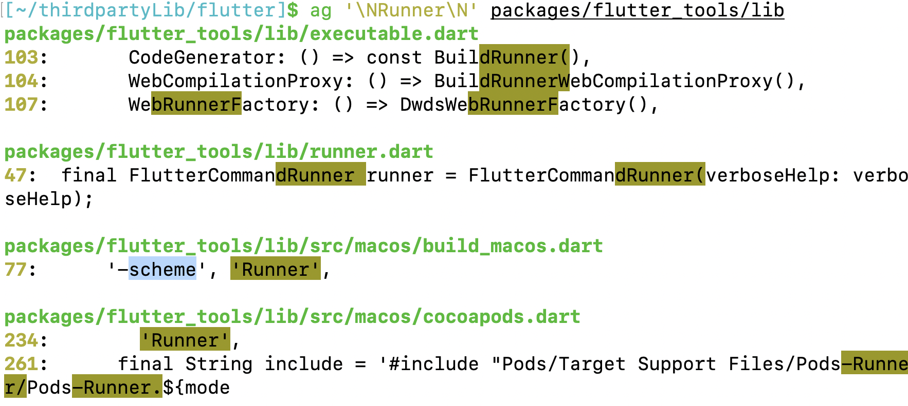
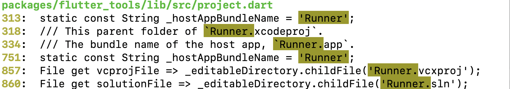
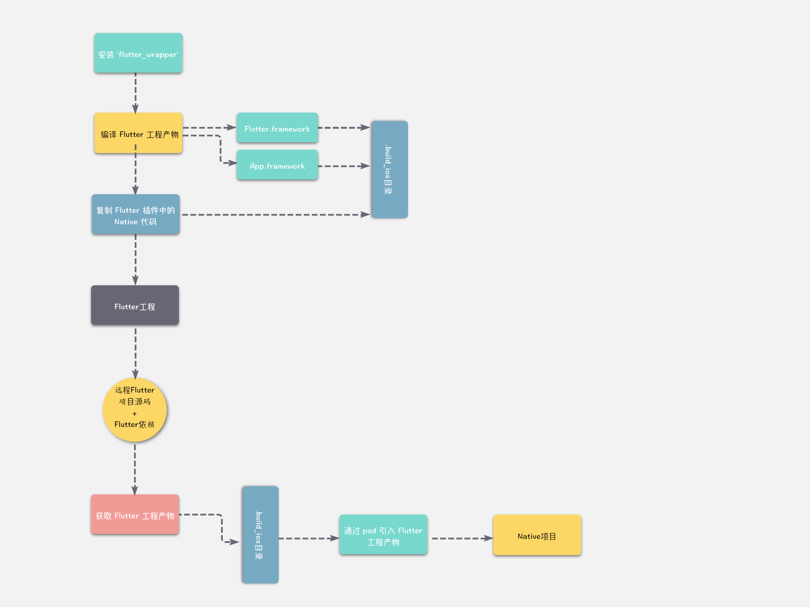

# Flutter混编方案

### Flutter version 
```
Flutter (Channel stable, v1.9.1+hotfix.6, on Mac OS X 10.15.1 19B88, localezh-Hans-CN)
```

## 目录


## 为什要关注`Flutter`混编的方案？
我们都知道任何语言的运行都离不开编译，`Flutter`的编译模式分为两种：
- JIT(Just In Time)：即使编译，运行时编译，同时可以动态下发和执行代码，方便调试，但是会影响性能；
- AOT(Ahead Of Time)：运行前编译。在程序运行前提前编译生成二进制文件，避免运行时编译消耗性能和内存，不占用程序启动时的一些编译资源。但会占用更多的存储空间，同时需要提前知道需要编译的架构，可能需要为不同的架构平台生成不一样的二进制。

在我们了解了`Flutter`的编译模式之后，下来我们来看一下在两种模式下的`Flutter`的编译产物：
* JIT 模式编译后的产物：

  在Debug下，Flutter采用的时JIT编译方式，将相关的Dart代码，

  Flutter 在代码编写阶段(Debug)是采用 JIT 方式编译代码，所有相关的 Dart 代码编译之后打包在 APK 下的 assets 目录下，是由对应的 libs 目录下的 .so 库中虚拟机执行。

  libs 目录下对应的不同架构平台的 Flutter 执行虚拟机；

  另外 assets 目录下 kernel_blob.bin 是 Flutter 引擎的底层接口和 Dart 语言基本功能部分代码；

  platform.dill 则是实现了 Flutter 页面逻辑的代码，也包括 Flutter Framework 和其他由 pub 依赖的库代码，和 Dart VM 相关的 kernel 代码，仅和 Dart 版本以及 engine 编译版本有关。
* AOT 模式编译后产物：
  
  Flutter 在 Release 模式下关闭了所有调试信息和断言，包的大小都做了优化。

  FLutter 在 Release 模式下采用 AOT 模式，solate_snapshot_data、vm_snapshot_data、isolate_snapshot_instr、vm_snapshot_instr。对比 JIT 模式下，不认识的产物有：isolate_snapshot_instr 和 vm_snapshot_instr，其实它俩代表着 VM 和 isolate 启动后所承载的指令等数据。在载入后，直接将该块内存执行即可；

  snapshot 文件由 Flutter SDK 中的 flutter/bin/cache/artifacts/engine/ios-release/gen_snapshot 生成，vmsnapshot* 是 Dart 虚拟机运行所需要的数据和代码指令，isolatesnapshot* 则是每个 isolate 运行所需要的数据和代码指令。

  理解 Flutter 编译产物的性质，有助于我们更加方便的集成 Flutter/Dart 运行时或者 Debug 时所需要的依赖到现有 Android / iOS 工程中，从而更加方便的模块化开发。

  在总结一下，在iOS下的产物都是三个（安卓类似）：
  1. App.framework：和 flutter 的业务逻辑相关，在 Debug 模式下就是一个很小的空壳，在 Release 模式下包含全部业务逻辑；
  2. flutter_assets：也和 flutter 的业务逻辑相关，在 Debug 模式下包含全部业务逻辑，在 Release 模式下很小，Flutter依赖的静态资源，如字体，图片等；
  3. Flutter.framework：实现 Flutter 框架自己的逻辑。
### 官方方案的优缺点
- 优点：

  不需要每次 Run 起来之后，先进行 同步flutter代码（组件化Flutter后，因为组件化后flutter代码已经变为framework，所以每次进来需要先热更新同步代码

  不需要单独搞一个组件进行集成，管理组件的版本，发布等
- 缺点：
  
  会非常耦合工程，需要修改工程配置，添加 BUILD PHASE 调用 flutter 中 xcode_backend.sh 脚本 去编译 Flutter

  如果使用pod管理，那么还需修改xcconfig配置

  因为需要调用 Flutter 的编译脚本，所以这种方式集成后，团队内所有组员电脑和打包机，都必须安装Flutter环境才能编译成功

这显然是不能接受的。其实我们先不考虑 Flutter 这件事，不管是搭建什么类型的混合工程，都一定要保证以下两点：
  1. 对原生工程无侵入：原生工程可以增加组件的依赖，但不能修改主工程的配置，更不能让原生工程对环境产生新的依赖
  2. 方便调试：不管是原生工程开发，调试新接入的模块（比如 Flutter），还是模块开发调试原生工程，都应该支持断点调试

很明显，官网的方案不满足第一点要求，我们不能让每个参与原生工程开发的同学，本机都安装 Flutter 环境

通过查看 Flutter 编译脚本xcode_backend.sh 和 测试单独引入编译产物，发现其实 只要拥有 Flutter 的编译产物，项目就可以接入 Flutter 的功能

所以说只要把Flutter编译好的产物，放在工程里，那么就无需配置每次调用 xcode_backend.sh 脚本，也无需强耦合Flutter环境，不需要所有组员安装Flutter环境，只需要有发布开发需求的同学进行安装即可

从 Flutter 的官网教程 中可以看到，它支持 flutter run 命令或者从 IDE 启动 iOS 工程。其实只要观察一下 ios 目录下的 Runner.xcworkspace 工程就会发现，Flutter 项目运行的就是这个工程。当然如果直接把我们的 iOS 工程拷贝过来是无法运行的。

我们可以在flutter/packages/flutter_tools/lib/src/project.dart文件中得到验证。首先我们进入到flutter所在的目录，然后执行：

```zsh
ag '\NRunner\N' packages/flutter_tools/lib
```
可以看到：


在`Flutter`中写死了`scheme`的就是`Runner`。

### 目前主流的混合方案

1. 直接修改Flutter Dart源码，也就是修改`Flutter Framework`，然后利用上文讲到的`编译Flutter Framework`，重新编译制作Flutter.framework，然后替换。但是后续如果 Flutter 升级了，还得把修改的部分应用到新的分支上去，并且修复冲突，同时接入成本高，要求大家都是用修改过的Flutter.framework。

2. 将Flutter的依赖抽取出来，作为一个Flutter依赖库发布到远程，供纯Native工程引用

下面我们着重来讲讲第二种方案。

完全脱离Flutter的方案其实本质上都是大同小异，都是将Flutter的编译产物剥离开来后，通过一种引入方式（例如Cocapods），引入到原生工程中。

- [以闲鱼为代表的方案](https://www.yuque.com/xytech/flutter/pfoy9x)

  

因为闲鱼的文章也没有进行过多的具体说明，所以我们结合这篇《[从零搭建 iOS Native Flutter 混合工程](https://juejin.im/post/5c3ae5ef518825242165c5ca)》来理解一下。


大致的流程就是这样的，具体的分析原文已经介绍的很清楚了。

我们回过头来来看看这种方式还有没有优化的地方。

首先整个产物的编译，拉取，包括版本控制，应该通过CI自动化的方式来完成。例如，在将整个Flutter工程产物的编译放到CI中。如果作为原生开发，不需要知道Flutter项目的具体细节，那么它只需要拉去相应的Flutter产物，和对应的dSYM文件即可，而不需要将整个Flutter项目都拉取下来，但是要注意对应的分支问题。

### Flutter产物归档与符号表备份

自定义引擎编译完成后，我们需要将产物进行归档以备使用，同时为了定位到crash时发生的堆栈信息，我们需要将符号表进行备份。

v1.9.1版本所有分发到终端用户电脑中的产物，iOS共有3个，分别是debug产物, profile产物，release产物，但是debug产物由ios_debug_arm, ios_debug_arm64, ios_debug_sim三个产物经过lipo合成一个ios产物，profile产物由ios_profile_arm, ios_profile_arm64, ios_debug_sim三个产物经过lipo合成一个ios-profile产物，release产物由ios_release_arm, ios_release_arm64, ios_debug_sim三个产物经过lipo合成一个ios-release产物，最终就是终端用户看到的三个产物

进入到engine/src目录，执行如下命令调用gn生成Ninja配置文件

```zsh
cd /path/to/engine/src

./flutter/tools/gn --runtime-mode=debug --ios-cpu=arm --ios
./flutter/tools/gn --runtime-mode=profile --ios-cpu=arm --ios
./flutter/tools/gn --runtime-mode=release --ios-cpu=arm --ios
./flutter/tools/gn --runtime-mode=debug --ios-cpu=arm64 --ios
./flutter/tools/gn --runtime-mode=profile --ios-cpu=arm64 --ios
./flutter/tools/gn --runtime-mode=release --ios-cpu=arm64 --ios
./flutter/tools/gn --runtime-mode=debug --ios-cpu=x86 --ios
./flutter/tools/gn --runtime-mode=debug --ios-cpu=x64 --ios
```

构建前执行clean

```zsh
ninja -C out/ios_debug_arm -t clean
ninja -C out/ios_profile_arm -t clean
ninja -C out/ios_release_arm -t clean
ninja -C out/ios_debug -t clean
ninja -C out/ios_profile -t clean
ninja -C out/ios_release -t clean
ninja -C out/ios_debug_sim -t clean
```

调用ninja执行构建

```

ninja -C out/ios_debug_arm
ninja -C out/ios_profile_arm
ninja -C out/ios_release_arm
ninja -C out/ios_debug
ninja -C out/ios_profile
ninja -C out/ios_release
ninja -C out/ios_debug_sim
```

构建完成我们需要将Flutter.framework文件和gen_snapshot文件进行归档，同时需要制作dSYM符号表文件。

iOS提供了两个工具，一个是用于Flutter.framework的规定及符号表导出，另一个是用于gen_snapshot文件的归档，他们位于engine/src/flutter/sky/tools/create_ios_framework.py和engine/src/flutter/sky/tools/create_macos_gen_snapshots.py

执行如下命令完成产物归档及符号表备份，注意只有release构建需要执行strip操作。

```
cd /path/to/engine/src

./flutter/sky/tools/create_ios_framework.py \
--arm64-out-dir /Users/lizhangqu/software/flutter_dev/engine/src/out/ios_release \
--armv7-out-dir /Users/lizhangqu/software/flutter_dev/engine/src/out/ios_release_arm  \
--simulator-out-dir /Users/lizhangqu/software/flutter_dev/engine/src/out/ios_debug_sim  \
--dst /Users/lizhangqu/software/flutter_dev/engine/src/out/flutter-engine/artifacts/ios-release \
--strip --dsym

./flutter/sky/tools/create_ios_framework.py \
--arm64-out-dir /Users/lizhangqu/software/flutter_dev/engine/src/out/ios_profile \
--armv7-out-dir /Users/lizhangqu/software/flutter_dev/engine/src/out/ios_profile_arm  \
--simulator-out-dir /Users/lizhangqu/software/flutter_dev/engine/src/out/ios_debug_sim  \
--dst /Users/lizhangqu/software/flutter_dev/engine/src/out/flutter-engine/artifacts/ios-profile \
--dsym

./flutter/sky/tools/create_ios_framework.py \
--arm64-out-dir /Users/lizhangqu/software/flutter_dev/engine/src/out/ios_debug \
--armv7-out-dir /Users/lizhangqu/software/flutter_dev/engine/src/out/ios_debug_arm  \
--simulator-out-dir /Users/lizhangqu/software/flutter_dev/engine/src/out/ios_debug_sim  \
--dst /Users/lizhangqu/software/flutter_dev/engine/src/out/flutter-engine/artifacts/ios \
--dsym

./flutter/sky/tools/create_macos_gen_snapshots.py \
--arm64-out-dir /Users/lizhangqu/software/flutter_dev/engine/src/out/ios_release \
--armv7-out-dir /Users/lizhangqu/software/flutter_dev/engine/src/out/ios_release_arm \
--dst /Users/lizhangqu/software/flutter_dev/engine/src/out/flutter-engine/artifacts/ios-release

./flutter/sky/tools/create_macos_gen_snapshots.py \
--arm64-out-dir /Users/lizhangqu/software/flutter_dev/engine/src/out/ios_profile \
--armv7-out-dir /Users/lizhangqu/software/flutter_dev/engine/src/out/ios_profile_arm \
--dst /Users/lizhangqu/software/flutter_dev/engine/src/out/flutter-engine/artifacts/ios-profile

./flutter/sky/tools/create_macos_gen_snapshots.py \
--arm64-out-dir /Users/lizhangqu/software/flutter_dev/engine/src/out/ios_debug \
--armv7-out-dir /Users/lizhangqu/software/flutter_dev/engine/src/out/ios_debug_arm \
--dst /Users/lizhangqu/software/flutter_dev/engine/src/out/flutter-engine/artifacts/ios

mkdir -p /Users/lizhangqu/software/flutter_dev/engine/src/out/flutter-engine/symbols/ios
mv /Users/lizhangqu/software/flutter_dev/engine/src/out/flutter-engine/artifacts/ios/Flutter.dSYM /Users/lizhangqu/software/flutter_dev/engine/src/out/flutter-engine/symbols/ios/Flutter.dSYM

mkdir -p /Users/lizhangqu/software/flutter_dev/engine/src/out/flutter-engine/symbols/ios-profile
mv /Users/lizhangqu/software/flutter_dev/engine/src/out/flutter-engine/artifacts/ios-profile/Flutter.dSYM /Users/lizhangqu/software/flutter_dev/engine/src/out/flutter-engine/symbols/ios-profile/Flutter.dSYM

mkdir -p /Users/lizhangqu/software/flutter_dev/engine/src/out/flutter-engine/symbols/ios-release
mv /Users/lizhangqu/software/flutter_dev/engine/src/out/flutter-engine/artifacts/ios-release/Flutter.dSYM /Users/lizhangqu/software/flutter_dev/engine/src/out/flutter-engine/symbols/ios-release/Flutter.dSYM
mv /Users/lizhangqu/software/flutter_dev/engine/src/out/flutter-engine/artifacts/ios-release/Flutter.unstripped /Users/lizhangqu/software/flutter_dev/engine/src/out/flutter-engine/symbols/ios-release/Flutter.unstripped


cp /Users/lizhangqu/software/flutter_dev/engine/src/out/ios_debug/Flutter.podspec /Users/lizhangqu/software/flutter_dev/engine/src/out/flutter-engine/artifacts/ios/Flutter.podspec
cp /Users/lizhangqu/software/flutter_dev/engine/src/out/ios_profile/Flutter.podspec /Users/lizhangqu/software/flutter_dev/engine/src/out/flutter-engine/artifacts/ios-profile/Flutter.podspec
cp /Users/lizhangqu/software/flutter_dev/engine/src/out/ios_release/Flutter.podspec /Users/lizhangqu/software/flutter_dev/engine/src/out/flutter-engine/artifacts/ios-release/Flutter.podspec


cp /Users/lizhangqu/software/flutter_dev/engine/src/out/ios_debug/LICENSE /Users/lizhangqu/software/flutter_dev/engine/src/out/flutter-engine/artifacts/ios/LICENSE
cp /Users/lizhangqu/software/flutter_dev/engine/src/out/ios_profile/LICENSE /Users/lizhangqu/software/flutter_dev/engine/src/out/flutter-engine/artifacts/ios-profile/LICENSE
cp /Users/lizhangqu/software/flutter_dev/engine/src/out/ios_release/LICENSE /Users/lizhangqu/software/flutter_dev/engine/src/out/flutter-engine/artifacts/ios-release/LICENSE
```


**补充**
#### ag
UNIX/Linux 系统有不少好用的工具，用于文本搜索的 grep 或许是其中最常用的工具之一。尽管平时称心如意，在面对数百万行的代码库时，grep 的用户体验实在堪忧。还好，我们有 the silver searcher （即 ag）这样迅捷的替代品

- 它比ack还要快 （和grep不在一个数量级上）
- 它会忽略.gitignore和.hgignore中的匹配文件
- 如果有你想忽略的文件，你需要将(congh .min.js cough*)加入到.ignore文件中
- 它的命令名称更短。

##### 安装
在MacOS下安装`the silver searcher(ag)`：
```zsh
brew install the_silver_searcher
```
安装后，系统会新增一个 ag 指令来使用 the silver searcher。作者应该是看穿了人类懒惰的本性，选取了一个比 grep 更短的名字。
##### 使用
关于文本搜索，最常见的用法是：
```zsh
ag "string-to-search"
```
此时 ag 会遍历当前目录下的文本文件，在每个文件的每一行中查找 "string-to-search" 这种模式，把文件名、行号和匹配的内容高亮显示出来。由于模式可以是一个正则表达式，使得搜索功能极为强大。

如果想在某个指定的目录下搜索，或只搜索某个文件的内容，在搜索的字符串后面加上路径就行：

```zsh
ag "string-to-search" /path/to/directory
```

除此以外，ag -G 提供了强大的过滤功能，使搜索在特定的文件中进行。下面的例子只搜索 C 类型的文件
```zsh
ag -G ".+\.m" "string-to-search" /path/to/directory
```
ag 根据输入智能判定大小写的匹配方式。如果查询的字符串只含有小写字符，使用大小写不敏感的匹配方式；如果出现了大写字符，就改为大小写敏感的匹配方式。如果想要直接使用不敏感的匹配方式，请用 ag -i 选项。

另一个很有用的选项是 ag -w 的全词匹配，它要求匹配的字符串前后都需要有合适的分隔符。

如果想要搜索不满足特定模式的行，用 ag -v 对搜索结果取反。

最后，如果只关心有哪些文件匹配（而不在意文件的内容），可以用 ag -l 显示有匹配的文件名，类似的 ag -L 显示没有任何匹配的文件名。


### <span style="color:#65B687;">#</span> References

* [Flutter Engine Repo](https://github.com/flutter/flutter/wiki/Setting-up-the-Engine-development-environment)

* [Inside Flutter](https://flutter.dev/docs/resources/inside-flutter)

* [iOS 保持界面流畅的技巧 - ibireme](https://blog.ibireme.com/2015/11/12/smooth_user_interfaces_for_ios/)
* [ iOS Native Flutter 混合工程](https://juejin.im/post/5c3ae5ef518825242165c5ca)
