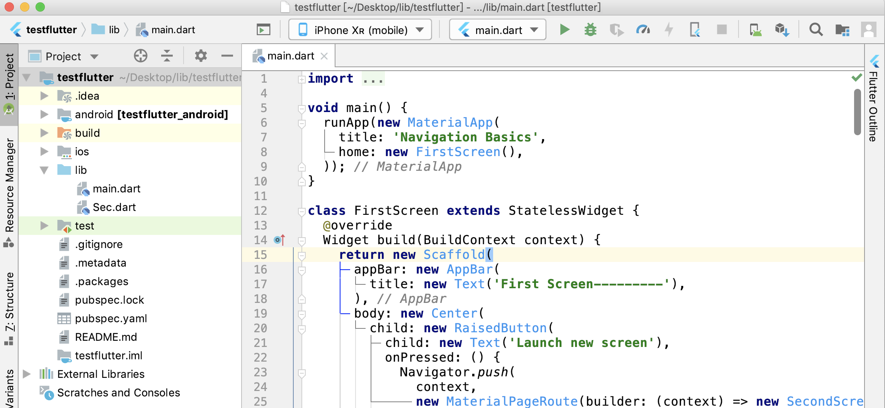
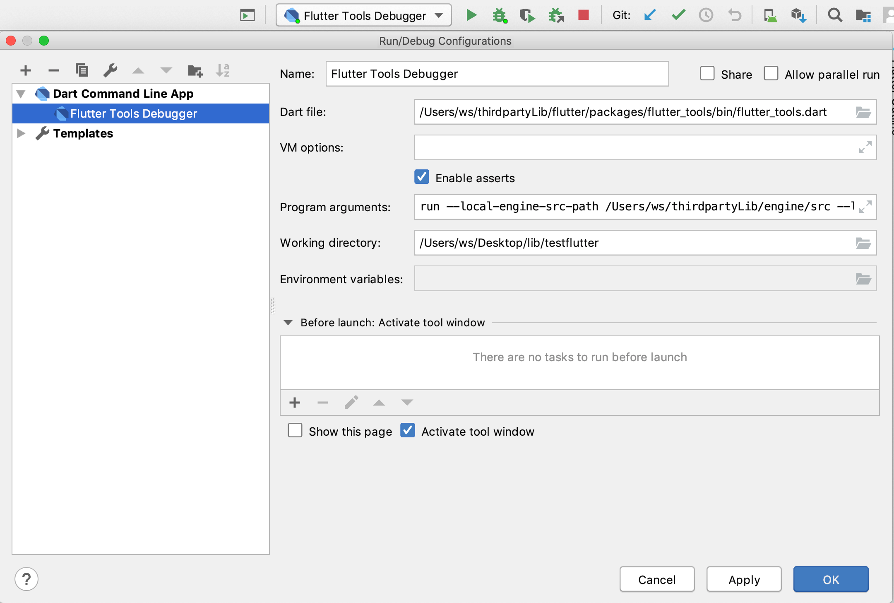

### Flutter Tools配合调试Flutter Engine

* [设置iOS模拟器](https://flutterchina.club/setup-macos/#%E8%AE%BE%E7%BD%AEios%E6%A8%A1%E6%8B%9F%E5%99%A8):

    ```
    open -a Simulator
    ```

* 首先创建一个flutter项目作为例子:

    

* 使用AndroidStudio（File>Open）打开flutter_tools（<你安装的flutter路径>/packages/flutter_tools），在run_hot.dart（../flutter_tools/lib/src/run_hot.dart）的HotRunner的restart()方法设置断点：

    ```dart
    @override
    Future<OperationResult> restart({ bool fullRestart = false, bool pauseAfterRestart = false, String reason }) async {
        if (fullRestart) { //全量更新，To hot restart (and rebuild state), press "R".
            ...
            /**
            1. 直接调用_launchFromDevFS(默认的main.dart 路径 + '.dill'),该方法会在 iOS应用tmp/应用名+xxxx/应用名/lib文件夹下生成main.dart.dill;
            2. 通过rpc调用flutter engine的restart()方法(源码位于engine/src/ flutter/shell/common/engine.cc);
            3. 从而触发kernel::Program::ReadFromBuffer()方法(源码位于engine/src/third_party/dart/runtime/vm/kernel.cc)，进而进行全局编译，最后触发widget刷新
            **/

            final OperationResult result = await _restartFromSources(reason: reason);
            ...
        } else { //增量更新，To hot reload changes while running, press "r".
            ...
            /**
            1. 首先调用_updateDevFS(),进行增量扫描,该方法会在 iOS应用tmp/应用名 +xxxx/应用名/lib文件夹下生成 以修改文件名.incremental.dill为后缀的增量更新文件;
            2. 通过rpc调用flutter engine的_reloadSources()方法(源码位于engine/src/third_party/dart/runtime/vm/service.cc);
            3. 从而触发kernel::Program::ReadFromFile()(源码位于engine/src/third_party/dart/runtime/vm/kernel.cc),进行增量编译，实现热更新;
            **/
       
            result = await _reloadSources();
            ...
        }
    }
    ```
* 添加新的Configuration：
    - 设置`Dart file`为：
        ```
        <你安装的flutter路径>/flutter/packages/flutter_tools/bin/flutter_tools.dart
        ```
    - 设置`Woking directory`为你要调试的flutter项目的路径
    - 设置`Program arguments`参数为：
        ```
        run
        ```
        如果同时要同时调试`Flutter Engine`，添加如下参数：
        - --local-engine-src-path <你本地Flutter Engine的路径>/engine/src，例如
            ```
            --local-engine-src-path /Users/ws/thirdpartyLib/engine/src
            ```
        - --local-engine=要调试的Engine类型
            ```
            --local-engine=ios_debug_sim_unopt
            ```
        如果AndroidStudio没有调试设备显示，还需要添加`-d`参数：
        ```
        -d <指定设备的UDID>
        ```

    
