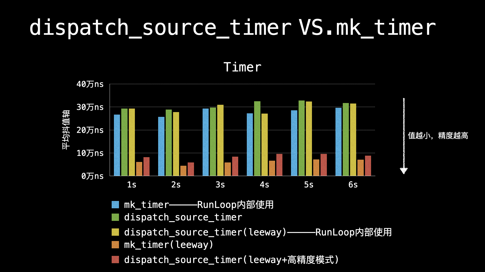

# RunLoop Timer
`RunLoop Timer`底层由两种`timer`实现：
* `dispatch_source_timer`:
        - 设置`leeway/tolerance`
* `mk_timer`:
    - 没有设置`leeway/tolerance`

## 配置数据
* interval：1毫秒 = 1000000纳秒
* leeway/tolerance = 333纳秒
 
## 计算公式

- 抖动值 = （timer触发后的当前时间 - 设置timer触发的时间）* 1000次 / 1000（计算取值一千次后的平均值）

## 测试结果
### 测试数据

|	    | 1s  | 2s  | 3s  |	 4s |	 5s |
|:---:|:---:|:---:|:---:|:---:|:---:|
|mk_timer①|	26.72|	25.72|	29.35|	27.21|	28.61|
|dispatch_source_timer|	29.35|	28.92|	29.72|	32.45|	32.88|
|dispatch_source_timer①②|	29.27|	27.75|	31.02|	27.09|	32.35|
|mk_timer②|	6.09|	4.48|	5.92|	6.61|	7.16|
|dispatch_source_timer②③|	8.18|	5.87|	8.43|	9.61|	9.63|

* 数据单位：万纳秒

* ①：代表`RunLoop`内部使用的`timer`
* ②：代表设置了`leeway/tolerance`
* ③：代表`dispatch_source_timer`高精度模式

### 图表展示

