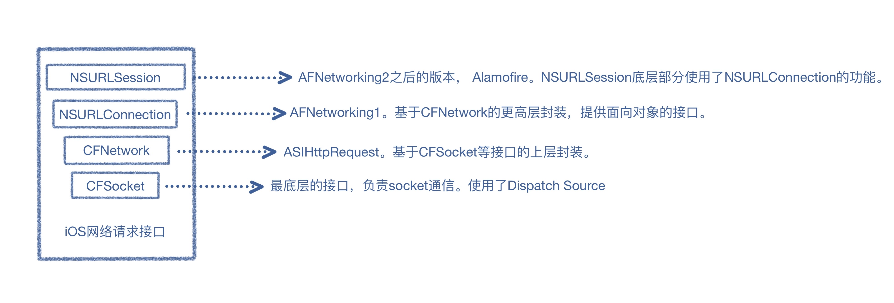
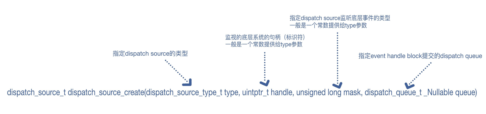

# Dispatch Source

## 前言

`dispatch source`和`runLoop source`都是用来监听事件的。你可以创建不同类型的`dispatch source`和`runLoop source`。`dispatch source`监听到事件产生时，会将`event handler`添加到目标`queue` 。`runLoop source`需要先按照某种模式加入到指定线程的`runLoop`中。`dispatch source`和`runLoop source`都是异步处理模式，只要创建、设置好，就可以在相应的`handler`中监听到相应事件的产生。

## 一、Dispatch Source与内核

`GCD`中除了主要的 `Dispatch Queue` 外，还有不太引人注目的 `Dispatch Source(信号源)`。它是`BSD`系内核惯有功能`kqueue`的包装。
    
* `BSD` (Berkeley Software Distribution，伯克利软件套件)：是`Unix`的衍生系统。例如：`OpenBSD`、`FreeBSD`、`macOS`。

* `kqueue(kernel queue)内核队列`: 最初是2000年`Jonathan Lemon`在`FreeBSD`系统上开发的一个高性能的事件通知接口。是用来实现`IO多路复用`。注册一批描述符注册到 `kqueue` 以后（被封装成`kevent`），当其中的描述符状态发生变化时，`kqueue` 将一次性通知应用程序哪些描述符可读、可写或出错了。`kqueue` 支持多种类型的文件描述符，包括 `socket`、文件状态、进程通讯等。`kqueue` 可以说是应用程序处理 `XNU` 内核中发生的各种事件的方法中最优秀的一种。其 `CPU` 负荷非常小，尽量不占用资源。

### 文件描述符
文件描述符（file descriptor）：在`Unix`中，任何可读/写也就是有`I/O`的能力，无论是文件、服务、功能、设备等都被操作系统抽象成简单的文件，提供一套简单统一的接口，这样程序就可以像访问磁盘上的文件一样访问串口、终端、打印机、网络等功能。大多数情况下只需要 `open/read/write/ioctl/close` 就可以实现对各种设备的输入、输出、设置、控制等。

普通文件的读写，也就是输入输出（Input/Output），把这种IO 放到广义的范围，放到整个Unix中，所有的IO ，就像一个广义的`File`。

 `文件描述符`在形式上是一个非负整数。实际上，它是一个索引值，指向内核为每一个进程所维护的该进程开启文件的记录表。当程式开启一个现有文件或者建立一个新文件时，内核向进程返回一个`文件描述符`。
 
> 为什么使用文件描述符而不像标准库那样使用文件指针？
>  因为记录文件相关信息的结构存储在内核中，为了不暴露内存的地址，因此文件结构指针不能直接给用户操
作，内核中记录一张表，其中一列是文件描述符，对应一列文件结构指针，文件描述符就相当于获取文件结构指
针的下标。

系统会为创建的每个`进程`默认会打开3个文件描述符：
* 标准输入(0)，是stderr
* 标准输出(1)，是stdout
* 标准错误(2)，是stderr

有时候，我们会在某些脚本中看到这样一种写法`>/dev/null 2>&1`：

>  这条命令其实分为两命令，一个是`>/dev/null`，另一个是`2>&1`。
> `/dev/null`是一个特殊的文件，写入到它的内容都会被丢弃；如果尝试从该文件读取内容，那么什么也读取不到。
> `>/dev/null`这条命令的作用是将标准输出(1)重定向到`/dev/null`中.
> `2>&1`的意思为将标准错误(2)指向标准输出(1)所指向的文件。此时所以此时的文件标准输出(1)和标准错误(2)都指向`/dev/null`。

#### `lsof`简介

`lsof` 是 `list open files` 的简称，它的作用主要是列出系统中打开的文件。乍看起来，这是个功能非常简单，使用场景不多的命令，不过是 ls 的另一个版本。`lsof` 可以知道用户和进程操作了哪些文件，也可以查看系统中网络的使用情况，以及设备的信息。

* 列出某个进程打开的所有文件：

    ```shell
    sudo lsof -p 5858
    ```

* 列出某个命令使用的文件信息：
    
    ```shell
    sudo lsof -c nginx
    ```
    `-c` 参数后面跟着命令的开头字符串，不一定是具体的程序名称，比如 `sudo lsof -c n` 也是合法的，会列出所有名字开头字母是 `n` 的程序打开的文件信息。

* 列出所有的网络连接信息：

    ```shell
    sudo lsof -i 
    ```

* 只显示 TCP 或者 UDP 连接：

    在 `-i` 后面直接跟着协议的类型（TCP 或者 UDP）就能只显示该网络协议的连接信息：
    
    ```shell
    sudo lsof -i TCP
    ```

* 查看某个端口的网络连接情况：
    
    ```shell
    sudo lsof -i :80
    ```
    
上面的命令输入每列的内容分别是：命令名称，进程 ID、用户名、FD、文件类型、文件所在的设备、文件大小或者所在设备的偏移量、`node/inode` 编号、文件名。

| 名称  |  说明  |  内容  |
| --- | --- | --- |
|  PID  |  进程ID  |  n/a  |
|  FD(file descriptor)  |  文件描述符  |  wd：当前工作目录<br /> rtd: 根目录<br /> mem：内存映射文件<br /> mmap：内存映射设备<br /> txt：应用文本（代码和数据）<br /> 数字+英文字: <数字为file descriptor编号，英文字为锁定模式>：<br />(a) r :只读模式<br />(b) w:只写模式<br />(c) u :读写模式 |
|  TYPE  |  n/a   |  IPv4：IPv4 socket<br />IPv6：IPv6 socket<br />inet：Internet Domain Socket<br />unix：unix domain socket<br />BLK：设备文件<br />CHR：字符文件<br />DIR：文件夹<br />FIFO：FIFO 文件<br />LINK：符号链接文件<br />REG：普通文件  |
|  DEVICE  |  设备号码  |  n/a  |
|  SIZE/OFF  |  文件大小/偏移量  |  n/a  |
|  NODE  |  inode编号，包含文件的元信息  |   文件的字节数<br />文件拥有者的User ID<br />文件的Group ID<br />文件的读、写、执行权限<br />文件的时间戳，共有三个：<br />(a) ctime指in`ode上一次变动的时间<br />(b) mtime指文件内容上一次变动的时间<br />(c) atime指文件上一次打开的时间<br />链接数，即有多少文件名指向这个inode<br />文件数据block的位置 |
|  NAME  |  打开的文件(即file descriptor 所指向的文件)  |  n/a  |

> inode：
> 可以用`stat`命令，查看某个文件的inode信息：`stat example.txt`。 每一个文件都有对应的`inode`，里面包含了与该文件有关的一些信息。每个`inode`都有一个号码，操作系统用`inode`号码来识别不同的文件。这里值得重复一遍，`Unix/Linux`系统内部不使用文件名，而使用`inode`号码来识别文件。对于系统来说，文件名只是`inode`号码便于识别的别称或者绰号。使用`ls -i`命令，可以看到文件名对应的`inode`号码。表面上，用户通过文件名，打开文件。实际上，系统内部这个过程分成三步：首先，系统找到这个文件名对应的`inode`号码；其次，通过`inode`号码，获取`inode`信息；最后，根据`inode`信息，找到文件数据所在的`block`，读出数据。

### IO多路复用

`CPU` 单核在同一时刻只能做一件事情，一种解决办法是对 `CPU` 进行时分复用 (多个事件流将 `CPU` 切割成多个时间片，不同事件流的时间片交替进行)。在计算机系统中，我们用线程或者进程来表示一条执行流，通过不同的线程或进程在操作系统内部的调度，来做到对 `CPU` 处理的时分复用。这样多个事件流就可以并发进行，不需要一个等待另一个太久，在用户看起来他们似乎就是并行在做一样。

但是凡事都是有成本的。线程/进程也一样，有这么几个方面：

* 线程/进程创建成本
* `CPU` 切换不同线程/进程成本 `Context Switch`
* 多线程的资源竞争

有没有一种可以在单线程/进程中处理多个事件流的方法呢？

一种答案就是 `IO 多路复用`。

什么是`IO多路复用`？

> 简单来说就是通过单线程或单进程同时监测若干个文件描述符是否可以执行 `IO` 操作的能力。通过把多个`I/O`的阻塞复用到同一个的阻塞上，从而使得系统在单线程或单进程的情况下可以同时处理多个客户端请求。

这样在处理1000个连接时，只需要1个线程或进程监控就绪状态，对就绪的每个连接开一个线程或进程处理就可以了。这样需要的线程或进程数大大减少，减少了内存开销和上下文切换的`CPU`开销。

内核实现`IO多路复用`有如下几种函数：

原理就是传入多个文件描述符，如果有一个文件描述符就绪，则返回，否则阻塞直到超时。得到就绪状态后进行真正的操作可以在同一个线程或进程里执行，也可以启动线程或进程来执行（比如使用线程池）。

*  `select`和`poll`函数
    采用数组和链表存储。在检查链表中是否有文件描述需要读写时，采用的是线性扫描的方法，即不管这些文件描述符是不是活跃的，都会轮询一遍，所以效率比较低。

* `epoll`和`kqueue`函数
    是之前的`select`和`poll`的增强版本，采用的是`Reacor`模型。采用红黑树和链表存储。会注册一个文件描述符，一旦基于某个文件描述符就绪时，内核会采用类似`callback`的回调机制，迅速激活这个文件描述符（省略掉了遍历文件描述符，而是通过监听回调的的机制）。

## 二、`Dispatch Source`功能介绍

`Dispatch Source` 也使用在了 `Core Foundation` 框架的用于异步网络的`CFSocket` 中。因为`Foundation` 框架的异步网络 `API` 是通过`CFSocket`实现的，所以可享受到仅使用 `Foundation` 框架的 `Dispatch Source` 带来的好处。


 
GCD 提供一个系列的`dsipatch source`用来充当监听底层系统对象：

* 文件描述符
* Mach port
* signals
* VFS 节点
等等

处于活动状态时的接口。当监听到事件产生的时候，`dsipatch source`会自动的将事件触发的回调`block`派发到指定的`dispatch queue`执行。

### dispatch_source_create

创建一个`dispatch source`来监视底层的系统事件。当监听的事件被触发时，`dsipatch source`会自动的将事件触发的回调`block`派发到指定的`dispatch queue`执行。



```oc
/*!
 * @function dispatch_source_create
 *
 * @discussion
 *  `dispatch source`不可重入。当`dispatch source`被挂起或者`event handler block`正在
 *  执行，这时候`dispatch source`接收到的多个事件会被合并。并且在`dispatch source`
 *  恢复或者正在执行的`event handler block`已经执行完毕之后，再来处理合并后的事
 *  件。
 *  
 *  `dispatch source`创建的时候是处于未被激活的状态的。
 *  当创建一个`dispatch source`，并且配置好了所需要的属性（例如：handler， context
 *  等）时。要想激活我们的`dispatch source`，可以通过调用`dispatch_activate()`，来开
 *  始接受事件。
 *
 * 在`dispatch source`未被激活前，可以调用`dispatch_set_target_queue()`来设置目标队
 * 列。但是，一旦激活后，就不允许再设置了。
 * 
 * 出于向后兼容的原因。对未激活和未挂起的`dispatch source`调用
 * `dispatch_resume()`，和调用`dispatch_activate()`有相同的作用。对于新代码，更好的
 * 激活方式是使用`dispatch_activate()`。
 *
 * @param type
 * 声明`dispatch source`的类型。必须是定义的`dispatch_source_type_t`常量中的一个。
 *
 * @param handle
 * 要监视的系统底层对象的句柄（标识符）。假如要监听进程，需要传入进程的ID。
 *
 * @param mask
 * 指定`dispatch source`要监听的底层对象的类型。提供更详细的描述，让它知道具体
 * 要监听什么
 *
 * @param queue
 * 指定`event handler block`提交到的目标queue。
 * 如果目标queue是`DISPATCH_TARGET_QUEUE_DEFAULT`。
 * `event handler block`将被提交默认的优先级的全局queue上。
 *
 * @result
 * 创建好的`dispatch source`。如果是`NULL`，说明传入了非法的参数。
 */
dispatch_source_t
dispatch_source_create(dispatch_source_type_t type,
	uintptr_t handle,
	unsigned long mask,
	dispatch_queue_t _Nullable queue)
```

#### dispatch_source_type_t

这种类型的常量表示`dispatch source`监视的底层系统对象的类型。此类型的常量作为参数传递给`dispatch_source_create()`。实际上`dispatch_source_create()`的`handle`（例如，作为文件描述符、mach port，信号数，进程标识符等）参数和`mask`参数，最后都是被传递到`dispatch_source_type_s`这个结构体中。
```oc
typedef const struct dispatch_source_type_s *dispatch_source_type_t;
```
可以使用的`dispatch_source_type_t`常量：

|  名称  |  说明  | dispatch_source_get_handle  |  dispatch_source_get_mask | dispatch_source_get_data |
| --- | --- | :-: | --- | :-: |
|  DISPATCH_SOURCE_TYPE_DATA_ADD  |  自定义事件，变量增加  |  n/a  |  n/a  | `ADD`操作后的数据 |
|  DISPATCH_SOURCE_TYPE_DATA_OR  |  自定义事件，变量OR  |  n/a  |  n/a  | `OR`操作后的数据 |
|  DISPATCH_SOURCE_TYPE_DATA_REPLACE  |  自定义事件，变量REPLACE。如果传入的数据是0，将不会触发`handler`  |  n/a  |  n/a  | `REPLACE`操作后的数据 |
|  DISPATCH_SOURCE_TYPE_MACH_SEND  |  监听 Mach port的`dead name`通知。handle是具有send权限的Mach port包括send或者是send-once。  |  mach port  |  dispatch_source_mach_send_flags_t: <br />//receive权限对应的send权限已经被销毁<br />DISPATCH_MACH_SEND_DEAD 0x1 | dispatch_source_mach_send_flags_t |
|  DISPATCH_SOURCE_TYPE_MACH_RECV  |  监听Mach port获取待处理的消息  |  mach port  |  dispatch_source_mach_recv_flags_t:  n/a | dispatch_source_mach_recv_flags_t |
|  DISPATCH_SOURCE_TYPE_MEMORYPRESSURE  |  监听系统中的内存压力  |  n/a  |    dispatch_source_memorypressure_flags_t: DISPATCH_MEMORYPRESSURE_NORMAL 0x01  DISPATCH_MEMORYPRESSURE_WARN 0x02  DISPATCH_MEMORYPRESSURE_CRITICAL 0x04  | dispatch_source_memorypressure_flags_t | 
|  DISPATCH_SOURCE_TYPE_PROC  |  监听进程事件  |  进程ID  |  dispatch_source_proc_flags_t:<br />//进程已经退出，也许已经被清理，也许没有<br />DISPATCH_PROC_EXIT 0x80000000<br />//进程创建了一个或多个子进程<br />DISPATCH_PROC_FORK 0x40000000<br />//进程成为另一个可执行映像（exec或posix_spawn函数族调用）<br />DISPATCH_PROC_EXEC 0x20000000<br />//进程接收到了Unix signal<br />DISPATCH_PROC_SIGNAL 0x08000000  | dispatch_source_proc_flags_t |
|  DISPATCH_SOURCE_TYPE_READ  |  监听文件描述符是否有可读的数据  |  文件描述符（int）  |  n/a  | 预估可读取的字节数 |
|  DISPATCH_SOURCE_TYPE_SIGNAL  |  监听当前进程的signal  |  signal number(int)  |    n/a | 上次`handler`调用时传递来的signal的编号 |
|  DISPATCH_SOURCE_TYPE_TIMER  |  定时器监听  |  n/a  |  dispatch_source_timer_flags_t:<br />//系统将尽最大努力保持精度。可能会导致更高的系统能耗<br />DISPATCH_TIMER_STRICT 0x1 | 上次`handler`调用时，已经发射的timer的编号 |
|  DISPATCH_SOURCE_TYPE_VNODE  |  监听文件描述符事件  |  文件描述符（int）  |   dispatch_source_vnode_flags_t:<br />DISPATCH_VNODE_DELETE 0x1 <br />DISPATCH_VNODE_WRITE 0x2<br />DISPATCH_VNODE_EXTEND 0x4<br />DISPATCH_VNODE_ATTRIB 0x8<br />DISPATCH_VNODE_LINK 0x10<br />  DISPATCH_VNODE_RENAME 0x20<br />DISPATCH_VNODE_REVOKE 0x40<br />DISPATCH_VNODE_FUNLOCK 0x100 | dispatch_source_vnode_flags_t |
|  DISPATCH_SOURCE_TYPE_WRITE  |  监听文件描述符使用可用的buffer空间来写数据  |  文件描述符（int）  |  n/a  | 预估可用的缓冲区空间大小 |

> 当`dispatch source`监测到系统内存压力升高，此时，我们应该通过改变接下来的内存使用行为来缓解内存压力。例如，在内存压力恢复正常之前，减少新开始初始化的操作带来的缓存大小。
> **注意**：当系统内存进入到提升状态时，应用程序不应该再继续当前的遍历操作或者释放过去操作带来的缓存，因为这可能进一步加大内存压力。

### dispatch_source_cancel
异步取消`dispatch source`，阻止`event handler block`被进一步调用：

```oc
/*!
 * @function dispatch_source_cancel
 *
 * @discussion
 * 取消`dispatch source`可以阻止`event handler block`的继续调用，但不会中断正在处理的`event handler block`。
 *
 * 当`dispatch source`的`event handler`已经完成，那么`cancel handler`将被提交到目标queue。
 * 并且此时表明可以安全的关闭`dispatch source`的句柄（标识符，即文件描述符或者mach port）。
 *
 * See dispatch_source_set_cancel_handler() for more information.
 *
 * @param source
 * 要取消的`dispatch source`。
 */
void
dispatch_source_cancel(dispatch_source_t source);
```
### dispatch_source_testcancel
测试`dispatch source`是否被取消：
```oc
/*!
 * @function dispatch_source_testcancel
 *
 * @param source
 * 要测试的`dispatch source`。
 *
 * @result
 * 0：未被取消；1：被取消。
 */
long
dispatch_source_testcancel(dispatch_source_t source);
```
### dispatch_source_merge_data
合并数据到类型是`DISPATCH_SOURCE_TYPE_DATA_ADD`、`DISPATCH_SOURCE_TYPE_DATA_OR`、`DISPATCH_SOURCE_TYPE_DATA_REPLACE`的`dispatch source`，并且提交相应的`event handler block`到指定的queue。

```oc
/*!
 * @function dispatch_source_merge_data
 *
 * @param source
 * 要合并数据的`dispatch source`。
 *
 * @param value
 * 根据`dispatch source`的类型，指定valve合并到挂起数据的操作：OR or ADD。
 * 如果valve为0，那么不会产生任何影响，也不会提交对应的`event handler block`。
 */
void
dispatch_source_merge_data(dispatch_source_t source, unsigned long value);
```

### dispatch_source_set_timer
配置`dispatch source timer`的开始时间（start time），interval（时间间隔），精度（leeway）：

```oc
/*!
 * @function dispatch_source_set_timer
 *
 * @discussion
 * 一旦再次调用这个方法，那么之前`source timer`的数据都会被清除。
 * `timer source`下次触发的时间将会是`start`参数设置的时间。
 * 此后，每隔`interval`纳秒将会继续触发，知道`timer source`被取消。
 *
 * 系统可能会延迟`timer source`的触发，以提高功耗和系统性能。
 * 对于刚开始的`timer source`允许的最大延迟上限为`leeway`纳秒。
 * 对于`start + N * interval`时间后触发的`timer source`，上限为`MIN(leeway, interval/2)`。下限由系统控制。
 * 
 * 允许延迟的下限可能随进程状态（如UI的显示情况）而变化。
 * 如果`timer source`是使用`DISPATCH_timer_STRICT`创建的。
 * 那么系统将尽最大努力遵守设置的“leeway”值，即使该值小于当前下限。
 * 也就是说，无论如何都可能产生延迟量。
 * 
 * `start`参数还能确定`timer source`使用的是那种类型的时钟：
 * 如果`start`参数传递的是：DISPATCH_TIME_NOW or dispatch_time()，
 * 那么底层使用的就是`Apple`平台的`mach_absolute_time()`。
 * 如果`start`参数传递的是：dispatch_walltime()，
 * 那么底层使用的是` gettimeofday()`。
 * 
 * 如果`dispatch source`已经被`cancel`，那么在调用这个函数就没意义了。
 *
 *
 * @param start
 * 开始时间。
 *
 * @param interval
 * `timer`的时间间隔，单位是纳秒。使用`DISPATCH_TIME_FOREVER`用在只发射一次的`timer`。
 *
 * @param leeway
 * `timer`的精度。单位是纳秒。
 */
void
dispatch_source_set_timer(dispatch_source_t source,
	dispatch_time_t start,
	uint64_t interval,
	uint64_t leeway);
```


### `dispatch source handler`函数

`dispatch source`监听事件产生触发的`handler`：

####  dispatch_source_set_event_handler 和 dispatch_source_set_event_handler_f
对指定的`dispatch source`设置`event handler`，用来响应`dispatch source`的触发：

```oc
/*!
 * @function dispatch_source_set_event_handler
 * 
 * @param source
 * 要修改的dispatch source。
 *
 * @param handler
 * 定义一个`event handler block` 提交到dispatch source指定的目标 queue。
 */
void
dispatch_source_set_event_handler(dispatch_source_t source,
	dispatch_block_t _Nullable handler);

/*!
 * @function dispatch_source_set_event_handler_f
 *
 * @param source
 * 要修改的dispatch source。
 *
 * @param handler
 * 定义一个`event handler function` 提交到dispatch source指定的目标 queue。
 */
void	
dispatch_source_set_event_handler_f(dispatch_source_t source,
	dispatch_function_t _Nullable handler);
```
#### dispatch_source_set_cancel_handler和dispatch_source_set_cancel_handler_f
对指定的`dispatch source`设置`cancel handler`，用于监听`dispatch source`的取消：

```oc
/*!
 * @function dispatch_source_set_cancel_handler
 *
 * @discussion
 * 当调用`dispatch_source_cancel()`时，一旦系统释放了所有`dispatch source`下的`handle(句柄)`引用，
 * 并且`event handler`也已经执行完毕，那么就会在会在指定目标`queue`上触发这个`cancel handler`。
 *
 * IMPORTANT:
 *  如果`dispatch source`监听的是文件描述符和mach port，那么就需要使用`cancel handler`。
 *  目的是安全的关闭文件描述符或者是正确的销毁mach port。
 *  如果，在触发`cancel handler`前，文件描述符或者mach port就已经关闭或者销毁，那么有可能会导致竞争条件。
 *  Race Condition竞争条件是指多个进程或者线程并发访问和操作同一数据且执行结果与访问发生的特定顺序有关的象。
 *  换句话说，就是线程或进程之间
 *  访问数据的先后顺序决定了数据修改的结果。
 *  如果新的文件描述符被初始化和当前关闭的文件描述符是一样的，当`dispatch source`的`event handler`仍在运行的时候，
 *  `event ahndler`有可能会在错误的文件描述符中read/write数据。  
 *
 * @param source
 * 要修改的dispatch source。
 *
 * @param handler
 * 定义一个`cancel handler block` 提交到dispatch source指定的目标 queue。
 */
void
dispatch_source_set_cancel_handler(dispatch_source_t source,
	dispatch_block_t _Nullable handler);

/*!
 * @function dispatch_source_set_cancel_handler_f
 *
 * @param source
 * 要修改的dispatch source。
 *
 * @param handler
 * 定义一个`cancel handler function` 提交到dispatch source指定的目标 queue。
 */
void
dispatch_source_set_cancel_handler_f(dispatch_source_t source,
	dispatch_function_t _Nullable handler);
```
#### dispatch_source_set_registration_handler
给指定的`dispatch source`设置一个`registration handler`：

```oc
/*!
 * @function dispatch_source_set_registration_handler
 *
 * @discussion
 * 如果指定了`registration handler`，会在相应的`kevent()`被注册到系统时，
 * 在`dispatch source`调用`dispatch_resume()`之前会被提交到指定的目标queue。
 * 如果`dispatch source`已经被注册了，再来添加`registration handler`，这个`registration handler`会立即执行。
 *
 * @param source
 * 要修改的dispatch source。
 *
 * @param handler
 * 定义一个`registration handler` 提交到dispatch source指定的目标 queue。
 */
void
dispatch_source_set_registration_handler(dispatch_source_t source,
	dispatch_block_t _Nullable handler);

/*!
 * @function dispatch_source_set_registration_handler_f
 *
 * @param source
 * 要修改的dispatch source。
 *
 * @param handler
 * 定义一个`registration handler` 提交到dispatch source指定的目标 queue。
 */
void
dispatch_source_set_registration_handler_f(dispatch_source_t source,
	dispatch_function_t _Nullable handler);
```

    
