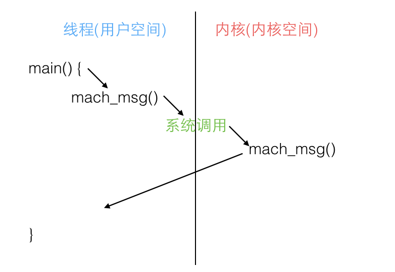
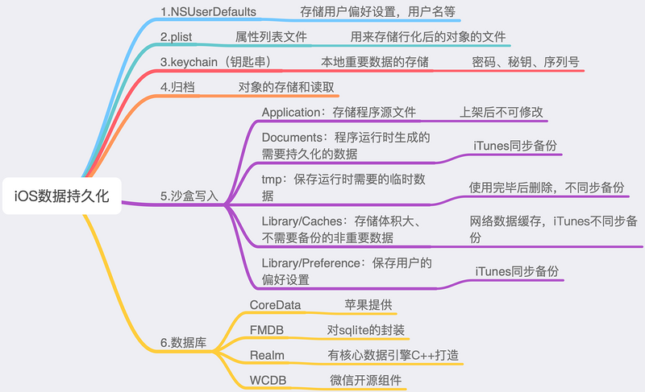

## RunLoop 与线程的关系

苹果不允许直接创建 RunLoop，它只提供了两个自动获取的函数：CFRunLoopGetMain() 和 CFRunLoopGetCurrent()。 这两个函数内部的逻辑大概是下面这样:

```objective-c
/// 全局的Dictionary，key 是 pthread_t， value 是 CFRunLoopRef
static CFMutableDictionaryRef loopsDic;
/// 访问 loopsDic 时的锁
static CFSpinLock_t loopsLock;
 
/// 获取一个 pthread 对应的 RunLoop。
CFRunLoopRef _CFRunLoopGet(pthread_t thread) {
    OSSpinLockLock(&loopsLock);
    
    if (!loopsDic) {
        // 第一次进入时，初始化全局Dic，并先为主线程创建一个 RunLoop。
        loopsDic = CFDictionaryCreateMutable();
        CFRunLoopRef mainLoop = _CFRunLoopCreate();
        CFDictionarySetValue(loopsDic, pthread_main_thread_np(), mainLoop);
    }
    
    /// 直接从 Dictionary 里获取。
    CFRunLoopRef loop = CFDictionaryGetValue(loopsDic, thread));
    
    if (!loop) {
        /// 取不到时，创建一个
        loop = _CFRunLoopCreate();
        CFDictionarySetValue(loopsDic, thread, loop);
        /// 注册一个回调，当线程销毁时，顺便也销毁其对应的 RunLoop。
        _CFSetTSD(..., thread, loop, __CFFinalizeRunLoop);
    }
    
    OSSpinLockUnLock(&loopsLock);
    return loop;
}
 
CFRunLoopRef CFRunLoopGetMain() {
    return _CFRunLoopGet(pthread_main_thread_np());
}
 
CFRunLoopRef CFRunLoopGetCurrent() {
    return _CFRunLoopGet(pthread_self());
}
```

从上面的代码可以看出，线程和 RunLoop 之间是一一对应的，其关系是保存在一个全局的 Dictionary 里。线程刚创建时并没有 RunLoop，如果你不主动获取，那它一直都不会有。RunLoop 的创建是发生在第一次获取时，RunLoop 的销毁是发生在线程结束时。你只能在一个线程的内部获取其 RunLoop（主线程除外）。

## RunLoop 对外的接口

在 CoreFoundation 里面关于 RunLoop 有5个类:

- CFRunLoopRef
- CFRunLoopModeRef
- CFRunLoopSourceRef
- CFRunLoopTimerRef
- CFRunLoopObserverRef

其中 CFRunLoopModeRef 类并没有对外暴露，只是通过 CFRunLoopRef 的接口进行了封装。他们的关系如下:


一个 RunLoop 包含若干个 Mode，每个 Mode 又包含若干个 Source/Timer/Observer。每次调用 RunLoop 的主函数时，只能指定其中一个 Mode，这个Mode被称作 CurrentMode。如果需要切换 Mode，只能退出 Loop，再重新指定一个 Mode 进入。这样做主要是为了分隔开不同组的 Source/Timer/Observer，让其互不影响。

`CFRunLoopSourceRef` 是事件产生的地方。Source有两个版本：Source0 和 Source1。
• Source0 只包含了一个回调（函数指针），它并不能主动触发事件。使用时，你需要先调用 CFRunLoopSourceSignal(source)，将这个 Source 标记为待处理，然后手动调用 CFRunLoopWakeUp(runloop) 来唤醒 RunLoop，让其处理这个事件。
• Source1 包含了一个 mach_port 和一个回调（函数指针），被用于通过内核和其他线程相互发送消息。这种 Source 能主动唤醒 RunLoop 的线程，其原理在下面会讲到。

`CFRunLoopTimerRef` 是基于时间的触发器，它和 NSTimer 是toll-free bridged 的，可以混用。其包含一个时间长度和一个回调（函数指针）。当其加入到 RunLoop 时，RunLoop会注册对应的时间点，当时间点到时，RunLoop会被唤醒以执行那个回调。

`CFRunLoopObserverRef` 是观察者，每个 Observer 都包含了一个回调（函数指针），当 RunLoop 的状态发生变化时，观察者就能通过回调接受到这个变化。可以观测的时间点有以下几个：

```c
typedef CF_OPTIONS(CFOptionFlags, CFRunLoopActivity) {
    kCFRunLoopEntry         = (1UL << 0), // 即将进入Loop
    kCFRunLoopBeforeTimers  = (1UL << 1), // 即将处理 Timer
    kCFRunLoopBeforeSources = (1UL << 2), // 即将处理 Source
    kCFRunLoopBeforeWaiting = (1UL << 5), // 即将进入休眠
    kCFRunLoopAfterWaiting  = (1UL << 6), // 刚从休眠中唤醒
    kCFRunLoopExit          = (1UL << 7), // 即将退出Loop
};
```

上面的 Source/Timer/Observer 被统称为 mode item，一个 item 可以被同时加入多个 mode。但一个 item 被重复加入同一个 mode 时是不会有效果的。如果一个 mode 中一个 item 都没有，则 RunLoop 会直接退出，不进入循环。

## RunLoop 的 Mode

这里有个概念叫 “CommonModes”：一个 Mode 可以将自己标记为”Common”属性（通过将其 ModeName 添加到 RunLoop 的 “commonModes” 中）。每当 RunLoop 的内容发生变化时，RunLoop 都会自动将 _commonModeItems 里的 Source/Observer/Timer 同步到具有 “Common” 标记的所有Mode里。

应用场景举例：主线程的 RunLoop 里有两个预置的 Mode：kCFRunLoopDefaultMode 和 UITrackingRunLoopMode。这两个 Mode 都已经被标记为”Common”属性。DefaultMode 是 App 平时所处的状态，TrackingRunLoopMode 是追踪 ScrollView 滑动时的状态。当你创建一个 Timer 并加到 DefaultMode 时，Timer 会得到重复回调，但此时滑动一个TableView时，RunLoop 会将 mode 切换为 TrackingRunLoopMode，这时 Timer 就不会被回调，并且也不会影响到滑动操作。

有时你需要一个 Timer，在两个 Mode 中都能得到回调，一种办法就是将这个 Timer 分别加入这两个 Mode。还有一种方式，就是将 Timer 加入到顶层的 RunLoop 的 “commonModeItems” 中。”commonModeItems” 被 RunLoop 自动更新到所有具有”Common”属性的 Mode 里去。

你只能通过 mode name 来操作内部的 mode，当你传入一个新的 mode name 但 RunLoop 内部没有对应 mode 时，RunLoop会自动帮你创建对应的 CFRunLoopModeRef。对于一个 RunLoop 来说，其内部的 mode 只能增加不能删除。

苹果公开提供的 Mode 有两个：kCFRunLoopDefaultMode (NSDefaultRunLoopMode) 和 UITrackingRunLoopMode，你可以用这两个 Mode Name 来操作其对应的 Mode。

同时苹果还提供了一个操作 Common 标记的字符串：kCFRunLoopCommonModes (NSRunLoopCommonModes)，你可以用这个字符串来操作 Common Items，或标记一个 Mode 为 “Common”。使用时注意区分这个字符串和其他 mode name.

## RunLoop 的内部逻辑


可以看到，实际上 RunLoop 就是这样一个函数，其内部是一个 do-while 循环。当你调用 CFRunLoopRun() 时，线程就会一直停留在这个循环里；直到超时或被手动停止，该函数才会返回。

## Mach

Mach 本身提供的 API 非常有限，而且苹果也不鼓励使用 Mach 的 API，但是这些API非常基础，如果没有这些API的话，其他任何工作都无法实施。在 Mach 中，所有的东西都是通过自己的对象实现的，进程、线程和虚拟内存都被称为”对象”。和其他架构不同， Mach 的对象间不能直接调用，只能通过消息传递的方式实现对象间的通信。”消息”是 Mach 中最基础的概念，消息在两个端口 (port) 之间传递，这就是 Mach 的 IPC (进程间通信) 的核心。

Mach 的消息定义是在 <mach/message.h> 头文件的，很简单：

```c
typedef struct {
  mach_msg_header_t header;
  mach_msg_body_t body;
} mach_msg_base_t;
 
typedef struct {
  mach_msg_bits_t msgh_bits;
  mach_msg_size_t msgh_size;
  mach_port_t msgh_remote_port;
  mach_port_t msgh_local_port;
  mach_port_name_t msgh_voucher_port;
  mach_msg_id_t msgh_id;
} mach_msg_header_t;
```

一条 Mach 消息实际上就是一个二进制数据包 (BLOB)，其头部定义了当前端口 local_port 和目标端口 remote_port，
发送和接受消息是通过同一个 API 进行的，其 option 标记了消息传递的方向：

```c
mach_msg_return_t mach_msg(
			mach_msg_header_t *msg,
			mach_msg_option_t option,
			mach_msg_size_t send_size,
			mach_msg_size_t rcv_size,
			mach_port_name_t rcv_name,
			mach_msg_timeout_t timeout,
			mach_port_name_t notify);
```

为了实现消息的发送和接收，mach_msg() 函数实际上是调用了一个 Mach 陷阱 (trap)，即函数mach_msg_trap()，陷阱这个概念在 Mach 中等同于系统调用。当你在用户态调用 mach_msg_trap() 时会触发陷阱机制，切换到内核态；内核态中内核实现的 mach_msg() 函数会完成实际的工作，如下图：



RunLoop 的核心就是一个 mach_msg() (见上面代码的第7步)，RunLoop 调用这个函数去接收消息，如果没有别人发送 port 消息过来，内核会将线程置于等待状态。例如你在模拟器里跑起一个 iOS 的 App，然后在 App 静止时点击暂停，你会看到主线程调用栈是停留在 mach_msg_trap() 这个地方。

## AutoreleasePool
App启动后，苹果在主线程 RunLoop 里注册了两个 Observer，其回调都是 _wrapRunLoopWithAutoreleasePoolHandler()。

第一个 Observer 监视的事件是 Entry(即将进入Loop)，其回调内会调用 _objc_autoreleasePoolPush() 创建自动释放池。其 order 是-2147483647，优先级最高，保证创建释放池发生在其他所有回调之前。

第二个 Observer 监视了两个事件： BeforeWaiting(准备进入休眠) 时调用_objc_autoreleasePoolPop() 和 _objc_autoreleasePoolPush() 释放旧的池并创建新池；Exit(即将退出Loop) 时调用 _objc_autoreleasePoolPop() 来释放自动释放池。这个 Observer 的 order 是 2147483647，优先级最低，保证其释放池子发生在其他所有回调之后。

在主线程执行的代码，通常是写在诸如事件回调、Timer回调内的。这些回调会被 RunLoop 创建好的 AutoreleasePool 环绕着，所以不会出现内存泄漏，开发者也不必显示创建 Pool 了。


## AFNetworking

RunLoop 启动前内部必须要有至少一个 Timer/Observer/Source，所以 AFNetworking 在 [runLoop run] 之前先创建了一个新的 NSMachPort 添加进去了。通常情况下，调用者需要持有这个 NSMachPort (mach_port) 并在外部线程通过这个 port 发送消息到 loop 内；但此处添加 port 只是为了让 RunLoop 不至于退出，并没有用于实际的发送消息。


iOS用什么方式实现对一个对象的KVO？（KVO的本质是什么？）
答. 当一个对象使用了KVO监听，iOS系统会修改这个对象的isa指针，改为指向一个全新的通过Runtime动态创建的子类，子类拥有自己的set方法实现，set方法实现内部会顺序调用willChangeValueForKey方法、原来的setter方法实现、didChangeValueForKey方法，而didChangeValueForKey方法内部又会调用监听器的observeValueForKeyPath:ofObject:change:context:监听方法。


如何手动触发KVO
通过设置 automaticallyNotifiesObserversForKey 为 False 实现取消自动触发。


答. 被监听的属性的值被修改时，就会自动触发KVO。如果想要手动触发KVO，则需要我们自己调用willChangeValueForKey和didChangeValueForKey方法即可在不改变属性值的情况下手动触发KVO，并且这两个方法缺一不可。

runtime 对注册的类， 会进行布局，对于 weak 对象会放入一个 hash 表中。 用 weak 指向的对象内存地址作为 key，当此对象的引用计数为0的时候会 dealloc，假如 weak 指向的对象内存地址是a，那么就会以a为键， 在这个 weak 表中搜索，找到所有以a为键的 weak 对象，从而设置为 nil。

原子性：一个操作或多个操作要么全部执行完成且执行过程不被中断，要么就不执行。

可见性：当多个线程同时访问同一个变量时，一个线程修改了这个变量的值，其他线程能够立即看得到修改的值。

有序性：程序执行的顺序按照代码的先后顺序执行。

## atomic

所以atomic的工作就是保护name这个指针的读写操作不会同时进行。至于name指向的内容，则不在atomic保护的范围之内。所以我们其实是有点误解atomic，以为它是可以保护name指向的内存地址的内容完整性。其实这并不是它的工作


## Block

自动变量是以值传递方式传递到Block的构造函数里面去的。Block只捕获Block中会用到的变量。由于只捕获了自动变量的值，并非内存地址，所以Block内部不能改变自动变量的值。Block捕获的外部变量可以改变值的是静态变量，静态全局变量，全局变量。上面例子也都证明过了。

_NSConcreteStackBlock：
只用到外部局部变量、成员属性变量，且没有强指针引用的block都是StackBlock。
StackBlock的生命周期由系统控制的，一旦返回之后，就被系统销毁了。

_NSConcreteMallocBlock：
有强指针引用或copy修饰的成员属性引用的block会被复制一份到堆中成为MallocBlock，没有强指针引用即销毁，生命周期由程序员控制

_NSConcreteGlobalBlock：
没有用到外界变量或只用到全局变量、静态变量的block为_NSConcreteGlobalBlock，生命周期从创建到应用程序结束。

没有用到外部变量肯定是_NSConcreteGlobalBlock，这点很好理解。不过只用到全局变量、静态变量的block也是_NSConcreteGlobalBlock。

_NSConcreteStackBlock是不持有对象的

_NSConcreteMallocBlock是持有对象的

_NSConcreteGlobalBlock也不持有对象

由于_NSConcreteStackBlock所属的变量域一旦结束，那么该Block就会被销毁。在ARC环境下，编译器会自动的判断，把Block自动的从栈copy到堆。比如当Block作为函数返回值的时候，肯定会copy到堆上。

1.手动调用copy
2.Block是函数的返回值
3.Block被强引用，Block被赋值给__strong或者id类型
4.调用系统API入参中含有usingBlcok的方法

但是当Block为函数参数的时候，就需要我们手动的copy一份到堆上了。这里除去系统的API我们不需要管，比如GCD等方法中本身带usingBlock的方法，其他我们自定义的方法传递Block为参数的时候都需要手动copy一份到堆上

__forwarding指针这里的作用就是针对堆的Block，把原来__forwarding指针指向自己，换成指向_NSConcreteMallocBlock上复制之后的__block自己。然后堆上的变量的__forwarding再指向自己。这样不管__block怎么复制到堆上，还是在栈上，都可以通过(i->__forwarding->i)来访问到变量值。

Block在捕获住__block变量之后，并不会复制到堆上，所以地址也一直都在栈上。这与ARC环境下的不一样。

ARC环境下，一旦Block赋值就会触发copy，__block就会copy到堆上，Block也是__NSMallocBlock。ARC环境下也是存在__NSStackBlock的时候，这种情况下，__block就在栈上。

MRC环境下，只有copy，__block才会被复制到堆上，否则，__block一直都在栈上，block也只是__NSStackBlock，这个时候__forwarding指针就只指向自己了

根据打印出来的结果来看，ARC环境下，Block捕获外部对象变量，是都会copy一份的，地址都不同。只不过带有__block修饰符的变量会被捕获到Block内部持有。

在MRC环境下，__block根本不会对指针所指向的对象执行copy操作，而只是把指针进行的复制。
而在ARC环境下，对于声明为__block的外部对象，在block内部会进行retain，以至于在block环境内能安全的引用外部对象，所以才会产生循环引用的问题！

## 消息转发

resolveInstanceMethod

forwardingTargetForSelector

forwardInvocation

methodSignatureForSelector

在对象类的 dispatch table 中尝试找到该消息。如果找到了，跳到相应的函数IMP去执行实现代码；


如果没有找到，Runtime 会发送 +resolveInstanceMethod: 或者 +resolveClassMethod: 尝试去 resolve 这个消息；


如果 resolve 方法返回 NO，Runtime 就发送 -forwardingTargetForSelector: 允许你把这个消息转发给另一个对象；


如果没有新的目标对象返回， Runtime 就会发送-methodSignatureForSelector: 和 -forwardInvocation: 消息。你可以发送 -invokeWithTarget: 消息来手动转发消息或者发送 -doesNotRecognizeSelector: 抛出异常。

# MVVM

MVVM即 Model-View-ViewModel

　　1.View主要用于界面呈现，与用户输入设备进行交互、

　　2.ViewModel是MVVM架构中最重要的部分，ViewModel中包含属性，方法，事件，属性验证等逻辑，负责View与Model之间的通讯

　　3.Model就是我们常说的数据模型，用于数据的构造，数据的驱动，主要提供基础实体的属性。

　　MVVM主要目的是分离视图和模型

　　MVVM优点：低耦合，可重用性，独立开发，可测试

get请求与post请求的区别

　　1.get是向服务器发索取数据的一种请求，而post是向服务器提交数据的一种请求

　　2.get没有请求体，post有请求体

　　3.get请求的数据会暴露在地址栏中，而post请求不会，所以post请求的安全性比get请求号

　　4.get请求对url长度有限制，而post请求对url长度理论上是不会收限制的，但是实际上各个服务器会规定对post提交数据大小进行限制。

# iOS数据持久化

- NSUserDefaults
- plist
- keychain（钥匙串）
- 归档
- 沙盒
- 数据库



1.NSUserDefaults
NSUserDefaults用于存储用户的偏好设置和用户信息,如用户名,是否自动登录,字体大小等.
数据自动保存在沙盒的Libarary/Preferences目录下.
NSUserDefaults将输入的数据储存在.plist格式的文件下,这种存储方式就决定了它的安全性几乎为0,所以不建议存储一些敏感信息如:用户密码,token,加密私钥等!
它能存储的数据类型为:NSNumber（NSInteger、float、double），NSString，NSDate，NSArray，NSDictionary，BOOL.
不支持自定义对象的存储.

使用注意点：

NSUserDefaults存储的数据都是不可变的,想将可变数据存入需要先转为不可变才可以存储.
NSUserDefaults是定时把缓存中的数据写入磁盘的，而不是即时写入，为了防止在写完NSUserDefaults后程序退出导致的数据丢失，可以在写入数据后使用synchronize强制立即将数据写入磁盘.

2.plist
即属性列表文件，全名是Property List，这种文件的扩展名为.plist，因此，通常被叫做plist文件。它是一种用来存储串行化后的对象的文件，用于存储程序中经常用到且数据量小而不经常改动的数据。
可以存储的类型:NSNumber，NSString，NSDate，NSData ,NSArray，NSDictionary，BOOL.
不支持自定义对象的存储.

使用注意点：
如果需要存储自定义类型的数据需要先进行序列化!

3.Keychain（钥匙串）
用于本地重要数据的存储,将数据加密后存储在本地更安全.如:密码,秘钥,序列号等.当你删除APP后Keychain存储的数据不会删除，所以在重装App后，Keychain里的数据还能使用。从ios 3.0开始，跨程序分享keychain变得可行而NSUserDefaults存储的数据会随着APP而删掉.
使用keychain时苹果官方已经为我们封装好了文件KeychainItemWrapper,引入即可使用.当然也可是使用其他优秀的第三方的封装,比如ssKeychain。

4.归档(NSKeyedArchiver)
归档是iOS开发中数据存储常用的技巧，归档可以直接将对象储存成文件，把文件读取成对象。
相对于plist或者userdefault形式，归档可以存储的数据类型更加多样，并且可以存取自定义对象。对象归档的文件是保密的，在磁盘上无法查看文件中的内容，更加安全。
遵守NSCoding协议，并实现该协议中的两个方法。如果是继承，则子类一定要重写那两个方法。因为子类在存取的时候，会去子类中去找调用的方法，没找到那么它就去父类中找，所以最后保存和读取的时候新增加的属性会被忽略。需要先调用父类的方法，先初始化父类的，再初始化子类的。
保存数据的文件的后缀名可以随意命名。


| 存储类型 | 安全性| 文件名后缀| 数据量大小 | 应用场景 |
|  ----  | ----  |--------|----------  |--------|
| NSUserDefaults | 不安全| plist | 小 | 用户偏好设置 | 用户名 |
|plist|	不安全|	plist|	小|	不经常改动|
|keychain|	安全| |小 | 密码、秘钥、序列号|
|归档|	安全|	任意|	大|	缓存|

5.沙盒
持久化在Document目录下，一般存储非机密数据。当App中涉及到电子书阅读、听音乐、看视频、刷图片列表等时，推荐使用沙盒存储。因为这可以极大的节约用户流量，而且也增强了app的体验效果.
Application：存放程序源文件，上架前经过数字签名，上架后不可修改。

Documents: 保存应运行时生成的需要持久化的数据,iTunes同步设备时会备份该目录。例如,游戏应用可将游戏存档保存在该目录。

tmp: 保存应运行时所需的临时数据,使⽤完毕后再将相应的文件从该目录删除。应用没有运行时,系统也可能会清除该目录下的文件。iTunes同步设备时不会备份该目录。

Library/Caches: 保存应用运行时生成的需要持久化的数据,iTunes同步设备时不会备份该目录。一般存储体积大、不需要备份的非重要数据，比如网络数据缓存存储到Caches下。

Library/Preference: 保存应用的所有偏好设置，如iOS的Settings(设置) 应会在该目录中查找应⽤的设置信息。iTunes同步设备时会备份该目录。

6.数据库


- (UIView *)hitTest:(CGPoint)point withEvent:(UIEvent *)event;

- (BOOL)pointInside:(CGPoint)point withEvent:(UIEvent *)event;

## Dart

语法简单明了，开发速度快、效率高，学习成本低。
简单但是功能强大，可以开发 Web、移动端、PC、服务器端、物联网等平台应用。
编译执行速度快，拥有自己的 Dart VM，在移动端和 Web 上拥有高性能。
全平台语言，可移植。Dart 类似于中间件语言，可以编译成不同平台的原生代码，可以很方便地扩展成跨平台应用语言，如 Android 和 iOS 平台。
语言的结构融合了 Java、C、JavaScrpit 的特点，并结合 React 响应式编程的思维规范进行构建的一个现代化编程语言。
Dart 的语法特点
面向对象的语言，一切数据类型、API 都是对象，都继承自 Object 类；
强类型语言，同时也是动态类型语言。对不确定类型的可以定义成一个动态类型；
Dart 没有设置定义访问域的关键字，如果某个变量或者方法、类的名称以"_"开头，说明这个变量或者方法、类是私有的，外部不可以调用使用；
Dart 有入口函数：main(){...}；类似于Java的public void main(String[] args){...};
Dart 吸收了很多现代编程语言的特点，加入了很多便捷的语法支持，可以明显缩减代码量和提高可读性；
拥有 Future 和 Streams 使用方式，可以进行类似 RxJava 式的使用。

BasicMessageChannel：用于传递字符串和半结构化的信息。
MethodChannel：用于传递方法调用（method invocation）。
EventChannel: 用于数据流（event streams）的通信。

Flutter 官方提供了一种 Platform Channel 的方案，用于 Dart 和平台之间相互通信。

核心原理：

Flutter应用通过Platform Channel将传递的数据编码成消息的形式，跨线程发送到该应用所在的宿主(Android或iOS)；
宿主接收到Platform Channel的消息后，调用相应平台的API，也就是原生编程语言来执行相应方法；
执行完成后将结果数据通过同样方式原路返回给应用程序的Flutter部分。
整个过程的消息和响应是异步的，所以不会直接阻塞用户界面。